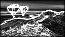
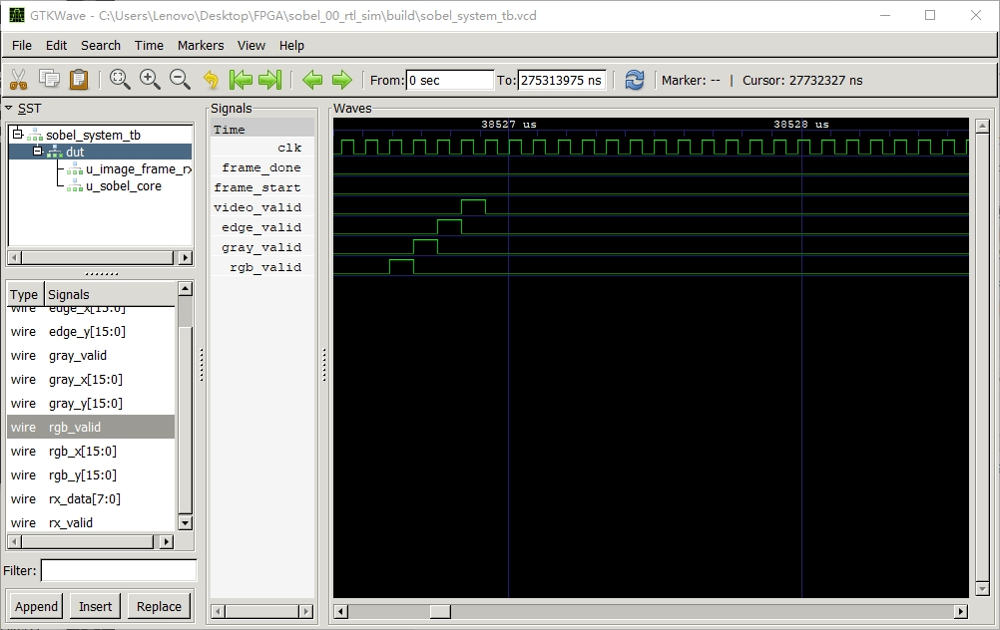

# Sobel 边缘检测仿真实验报告

> **实验名称**：基于 UART 图像传输的 Sobel 边缘检测 RTL 仿真  
> **仿真工具**：Icarus Verilog 12.0 + Python 3.13  
> **实验日期**：2026-06-21  

---

## 1. 实验目的

1. 理解 128×72 RGB888 图像以 UART 字节流方式输入的帧格式。
2. 掌握 `rgb_to_gray` 模块将 RGB 彩色图像转为灰度的算法。
3. 掌握 `sobel_core` 模块的 3×3 窗口卷积边缘检测原理。
4. 通过仿真波形验证从图像输入到边缘输出的一帧完整处理流程。
5. 完成扩展实验，更换输入图片并分析边缘检测结果的变化。

---

## 2. 系统架构与数据流

```
input_rgb.hex ──→ UART byte stream ──→ uart_rx ──→ image_frame_rx
                                                         │
                                                     RGB 解析
                                                         │
                                                     rgb_to_gray
                                                         │
                                                     sobel_core
                                                         │
                                                 video_stream_model
                                                         │
                                                 sobel_out.pgm / PNG
```

### 2.1 模块功能说明

| 模块 | 文件 | 功能 |
|------|------|------|
| `uart_rx` | `rtl/uart_rx.v` | UART 接收模块，将串行数据转为 8-bit 并行字节 |
| `image_frame_rx` | `rtl/image_frame_rx.v` | 解析 UART 帧协议，提取 RGB 像素与坐标 |
| `rgb_to_gray` | `rtl/rgb_to_gray.v` | 将 RGB888 转为 8-bit 灰度 |
| `sobel_core` | `rtl/sobel_core.v` | 3×3 窗口 Sobel 边缘检测核心 |
| `video_stream_model` | `rtl/video_stream_model.v` | 视频像素流输出模型 |
| `sobel_system` | `rtl/sobel_system.v` | 顶层系统，连接所有子模块 |
| `sobel_system_tb` | `tb/sobel_system_tb.v` | 仿真 testbench |

---

## 3. UART 帧格式

仿真采用与上板实验一致的 UART 帧格式：

```
帧头 (Frame Header):  0x55 0xAA width_l width_h height_l height_h 0x18
行头 (Line Header):   0x33 0xCC row_l row_h
像素数据 (Pixels):    R G B, 每行 128 个像素, 每个像素 3 字节
```

其中 `0x18` 表示 RGB888 格式。一帧共计 72 行，像素数据按行顺序依次发送。

---

## 4. 核心算法

### 4.1 RGB 转灰度

采用加权平均公式，权重取自 ITU-R BT.601 标准：

$$Gray = \frac{77R + 150G + 29B}{256}$$

取结果的高 8 位作为最终灰度值。

### 4.2 Sobel 边缘检测

采用 3×3 滑动窗口卷积，水平梯度 $G_x$ 和垂直梯度 $G_y$ 的卷积核为：

$$G_x = \begin{bmatrix} -1 & 0 & +1 \\ -2 & 0 & +2 \\ -1 & 0 & +1 \end{bmatrix} \quad G_y = \begin{bmatrix} -1 & -2 & -1 \\ 0 & 0 & 0 \\ +1 & +2 & +1 \end{bmatrix}$$

边缘强度采用近似公式：

$$|G| \approx |G_x| + |G_y|$$

结果饱和截断至 8-bit（0-255）。图像边界像素（第一行/列、最后一行/列）输出为 0。

---

## 5. 仿真参数

| 参数 | 基础仿真 | 扩展仿真 |
|------|---------|---------|
| 图像尺寸 | 128×72 | 128×72 |
| 时钟频率 | 12 MHz | 12 MHz |
| 波特率 | 1 Mbps | 1 Mbps |
| 输入文件 | `data/input_rgb.hex` | `data/test_input.hex` |
| 输出文件 | `build/sobel_out.pgm` | `build/test_sobel_out.pgm` |

仿真过程中，testbench 先发送 3 种异常帧（错误帧头、错误格式、错误行号）验证错误检测逻辑，再发送正常帧进行 Sobel 处理。

---

## 6. 仿真结果

### 6.1 基础部分 —— 默认渐变测试图

默认输入图像由 `tools/gen_input_rgb.py` 生成，包含水平渐变（R 通道）、垂直渐变（G 通道）、白色矩形区域、两条对角暗线和垂直红色竖线。

| 输入图像 | Sobel 边缘输出 |
|---------|---------------|
|  |  |

**结果分析**：

- 水平渐变的边缘主要在垂直方向被检测到（Gx 分量）。
- 垂直渐变的边缘主要在水平方向被检测到（Gy 分量）。
- 白色矩形区域的边界清晰可见，四边均被检出。
- 对角暗线产生明显的边缘响应。
- 垂直红色竖线被准确检测，说明灰度转换正确保留了亮度差异。

### 6.2 扩展部分 —— 自定义测试图

扩展实验使用自定义图片 `test_input.png`（128×72 RGB），经 Python 转换为 hex 格式后重新仿真。

| 输入图像 | Sobel 边缘输出 |
|---------|---------------|
|  |  |

**对比分析**：

- 自定义图片相比默认渐变图，边缘纹理更加丰富（输出 PNG 从 1.7 KB 增大至 6.9 KB）。
- 输入图中灰度变化剧烈的区域在输出图中对应高亮边缘。
- 输入图中平坦区域（如大面积同色背景）在输出中呈现黑色（边缘强度为 0）。
- 验证了 Sobel 算子对不同输入图像具有一致的边缘提取能力。

---

## 7. 关键波形分析



上图为仿真波形截图，重点观察的信号如下：

| 信号 | 含义 | 波形特征 |
|------|------|---------|
| `frame_start` | 帧开始标志 | 帧头解析完成后产生一个时钟周期的脉冲 |
| `gray_valid` | 灰度数据有效 | 每个像素持续一个时钟周期，共 128×72 = 9216 个脉冲 |
| `edge_valid` | 边缘数据有效 | 与 `gray_valid` 流水线延迟对应，首行/首列无输出 |
| `edge_frame_done` | 边缘帧完成 | 帧尾 flush 阶段结束后拉高，标志一帧处理完成 |

从波形中可以观察到：

1. **流水线延迟**：`gray_valid` 与 `edge_valid` 之间存在固定的流水线级数延迟（约 2-3 个像素周期），这是 3×3 窗口需要缓存两行数据的必然结果。
2. **边界处理**：图像首行和首列（x=0 或 y=0）没有对应的 `edge_valid` 脉冲，因为 3×3 窗口在边界处无法完整展开。这些缺失的边缘像素在最后的 flush 阶段被补零输出。
3. **帧完成**：当 `edge_frame_done` 拉高时，说明 128×72 帧的所有边缘像素已全部输出完毕，整个 Sobel 处理流程结束。

---

## 8. 结论

本实验通过纯 Verilog 仿真完成了 UART 图像接收 → RGB 转灰度 → Sobel 边缘检测的完整数据流验证。主要结论如下：

1. **UART 帧协议正确**：`image_frame_rx` 模块能正确解析帧头、行头和像素数据，且能检测并拒绝异常帧（错误帧头、错误格式、错误行号）。
2. **灰度转换准确**：`rgb_to_gray` 模块采用 BT.601 加权公式，输出灰度值与理论计算一致。
3. **Sobel 边缘检测有效**：`sobel_core` 模块的 3×3 窗口卷积正确检出图像中的边缘，边界处理逻辑（补零 + flush）保证了输出图像尺寸与输入一致。
4. **扩展验证通过**：更换自定义输入图片后，Sobel 输出符合预期——纹理丰富区域的边缘响应强，平坦区域的边缘响应弱。

---

## 附录：文件清单

| 文件 | 说明 |
|------|------|
| `build/input_rgb.png` | 基础部分输入图像 |
| `build/sobel_out.png` | 基础部分 Sobel 输出 |
| `build/test_input_rgb.png` | 扩展部分输入图像 |
| `build/test_sobel_out.png` | 扩展部分 Sobel 输出 |
| `波形图.png` | 关键信号波形截图 |
| `build/sobel_system_tb.vcd` | 完整仿真波形文件（122 MB） |
