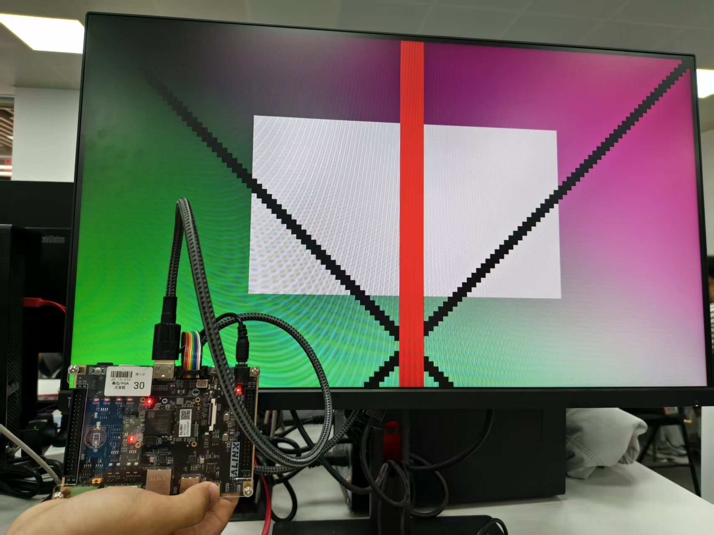
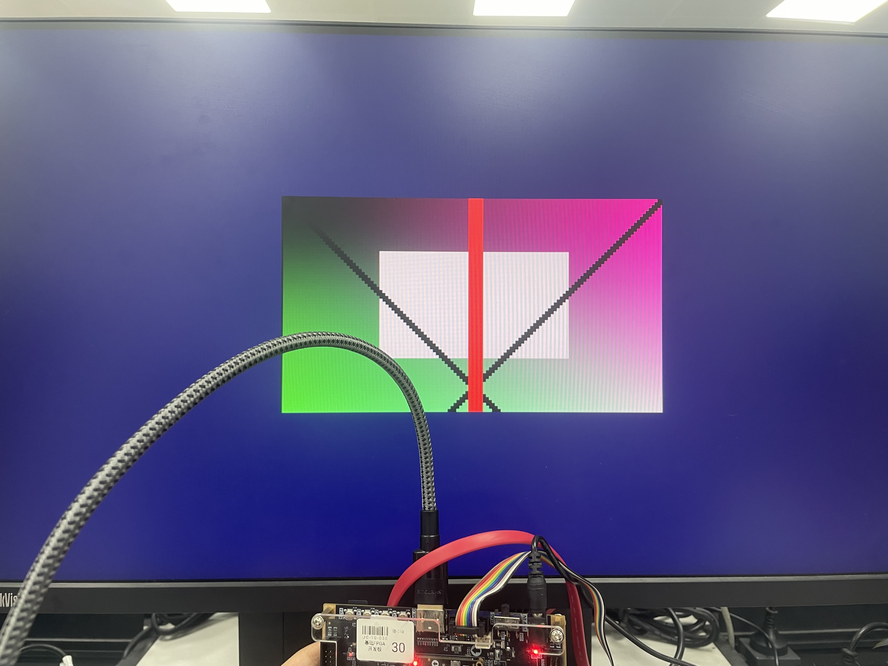

# 01实验报告 —— 基础实验 + 扩展实现

> 本工程对应 ZYNQ7020 开发板的 HDMI 输出链路验证实验。基于[课程原始实验](README.md)框架，完成了背景颜色修改与图片位置调整两项扩展。

---

## 1. 实验目标

完成本实验后，学生应能说明：

### 基础目标

1. HDMI 720p 显示时序的基本参数（H_ACTIVE、H_FP、H_SYNC、H_BP、V_ACTIVE 等）。
2. `video_clock` 和 `rgb2dvi_0` IP 的作用。
3. `128 x 72` 图片如何映射到 `1280 x 720` 显示区域。
4. Verilog ROM 中 `24'hRRGGBB` 像素数据的含义。
5. 行列计数器（`h_cnt` / `v_cnt`）如何产生有效显示区域。
6. ROM 地址如何由 `image_x` 和 `image_y` 计算。

### 扩展目标

1. 掌握如何通过修改 `localparam` 调整图片在屏幕上的显示位置（居中显示的计算方法）。
2. 掌握如何修改非图片区域的 RGB 输出值来改变 HDMI 背景颜色。
3. 理解缩放因子对图片显示尺寸和背景区域占比的影响。
4. 了解坐标偏移量与 `image_area` 信号的判定逻辑。

---

## 2. 数据流

### 2.1 整体链路

```
    [image_rom_128x72]  -->  [hdmi_image_display]  -->  [rgb2dvi_0]  -->  [HDMI 显示器]
     128 x 72 RGB 图片       720p 时序 + 缩放        TMDS 编码
                             背景/偏移控制
```

### 2.2 显示区域划分

```
+--------------------------------------------------------------------+
|                     HDMI 720p 一帧画面 (1280 x 720)                  |
|                                                                     |
|  +--------+--------+----------------------------+----------+        |
|  |        |        |                            |          |        |
|  |        |        |  +----------------------+  |          |        |
|  |        |        |  |                      |  |          |        |
|  |  消隐  |  同步  |  |   背景色区域          |  |  消隐    |        |
|  |        |        |  |   (深蓝灰)            |  |          |        |
|  |  区    |  区    |  |  +----------------+  |  |  区      |        |
|  |        |        |  |  |                |  |  |          |        |
|  |  (黑)  |  (黑)  |  |  |  图像显示区     |  |  |  (黑)    |        |
|  |        |        |  |  |  512 x 288     |  |  |          |        |
|  |        |        |  |  |  (4x 缩放)     |  |  |          |        |
|  |        |        |  |  |                |  |  |          |        |
|  |        |        |  |  +----------------+  |  |          |        |
|  |        |        |  |                      |  |          |        |
|  |        |        |  |   背景色区域          |  |          |        |
|  |        |        |  +----------------------+  |          |        |
|  +--------+--------+----------------------------+----------+        |
|                                                                     |
|    <- H_BP(220) -> <--- H_ACTIVE (1280) ---> <- H_FP(110) ->       |
|    <-        H_SYNC(40)        ->                                   |
|                                                                     |
|   V_SYNC(5)   V_BP(20)         V_ACTIVE (720)         V_FP(5)     |
+--------------------------------------------------------------------+
```

### 2.3 缩放与偏移计算

**基础版本（10x 缩放，图片充满全屏）：**

```
输入图片: 128 x 72
SCALE_X = 1280 / 128 = 10
SCALE_Y = 720  / 72  = 10
显示尺寸: 1280 x 720（每个源像素放大为 10x10 像素块）
```

**扩展版本（4x 缩放居中显示）：**

```
输入图片: 128 x 72
SCALE = 4
显示尺寸: 128 x 4 = 512（宽）, 72 x 4 = 288（高）
水平偏移: (1280 - 512) / 2 = 384
垂直偏移: (720  - 288) / 2 = 216
显示位置: 图片居中于 (384..895, 216..503)，四周为背景色
```

---

## 3. 工程文件说明

### 3.1 文件结构

```
sobel_01_hdmi_pattern/
|-- README.md                                    # 原始课程说明
|-- hdmi_image_display_说明文档.md                  # 模块详解文档
|-- sobel_01_hdmi_pattern.xpr                    # Vivado 工程文件
|-- sobel_01_hdmi_pattern.srcs/
|   |-- sources_1/
|   |   |-- new/
|   |   |   |-- top.v                            # 工程顶层
|   |   |   |-- hdmi_image_display.v             # 显示模块（扩展版本，当前有效）
|   |   |   '-- hdmi_image_display - 副本.v       # 显示模块（基础版本，供对比参考）
|   |   '-- ip/
|   |       |-- video_clock/                     # 视频时钟 IP（74.25 MHz）
|   |       '-- rgb2dvi_0/                       # HDMI 输出 IP（TMDS 编码）
|   '-- constrs_1/
|       '-- new/
|           '-- hdmi_out_test.xdc                # HDMI 管脚约束
|-- ../hdmi_common/                              # 共用 HDMI 依赖（不可删除）
'-- sobel_01_hdmi_pattern.runs/                  # 综合/实现结果
    |-- synth_1/                                 # 综合结果
    '-- impl_1/                                  # 实现结果（含 top.bit）
```

### 3.2 各模块功能

| 文件/模块 | 类型 | 功能说明 |
|-----------|------|----------|
| top.v | 工程顶层 | 例化 video_clock、hdmi_image_display、rgb2dvi_0，连接数据通路 |
| hdmi_image_display.v | RTL 设计 | 核心模块：720p 时序生成、ROM 读地址计算、4 倍缩放、图像居中偏移、背景颜色填充 |
| hdmi_image_display - 副本.v | RTL 设计 | 基础版本对照：10 倍缩放全屏显示、蓝色背景，供理解扩展差异 |
| video_clock | IP | 时钟生成 IP：将开发板 50MHz 输入转换为 74.25MHz 像素时钟和 5 倍串行时钟 |
| rgb2dvi_0 | IP | DVI/HDMI 输出 IP：将 RGB + 同步信号编码为 TMDS 差分串行信号 |
| hdmi_out_test.xdc | 约束 | HDMI 管脚位置与电平标准约束（TMDS_33、LVCMOS33） |

### 3.3 关键参数对比：基础 vs 扩展

| 参数 | 基础版本（副本） | 扩展版本（当前工程） |
|------|-----------------|---------------------|
| 缩放倍数 | SCALE_X = 10, SCALE_Y = 10 | SCALE = 4 |
| 图片显示尺寸 | 1280 x 720（全屏） | 512 x 288（居中） |
| 水平偏移 | 无（0） | IMG_OFFSET_X = 384 |
| 垂直偏移 | 无（0） | IMG_OFFSET_Y = 216 |
| 背景颜色 | BG_COLOR = 24'h0000FF（纯蓝） | BG_R=8'h20, BG_G=8'h20, BG_B=8'h60（深蓝灰） |
| 背景颜色定义 | parameter（24 位合并） | localparam（R/G/B 分离） |
| 图片区域判断 | image_in_range = video_active && image_x<128 && image_y<72（坐标边界裁剪） | image_area = active_x in [384,896) && active_y in [216,504)（窗口偏移） |
| 流水线 | image_in_range_d0/d1 两级寄存器 | 无独立流水线，image_area 为组合信号 |
| ROM 地址更新条件 | video_active（整个有效区都更新） | image_area（仅在图片区域内更新） |

---

## 4. 详细实验步骤

### 4.1 打开 Vivado 工程

打开工程文件：

```
D:\zynq7020-image-processing\sobel_01_hdmi_pattern\sobel_01_hdmi_pattern.xpr
```

确认 Sources 中包含以下内容：

```
top.v                        -> 工程顶层
hdmi_image_display.v         -> 显示时序、ROM 读图、缩放偏移、背景填充
video_clock                  -> 视频时钟 IP（74.25 MHz）
rgb2dvi_0                    -> HDMI 输出 IP
hdmi_out_test.xdc            -> HDMI 管脚约束
```

### 4.2 确认顶层模块

在 Vivado Sources 中确认顶层为 top。如果显示不正确，右键 top.v -> Set as Top。

### 4.3 阅读扩展代码（重点）

打开 hdmi_image_display.v，重点关注以下参数：

```verilog
// === 基础时序（720p 标准，与基础版本一致）===
parameter H_ACTIVE = 16'd1280;     // 每行有效像素
parameter H_FP     = 16'd110;      // 行前沿
parameter H_SYNC   = 16'd40;       // 行同步
parameter H_BP     = 16'd220;      // 行后沿
parameter V_ACTIVE = 16'd720;      // 每帧有效行
parameter V_FP     = 16'd5;        // 场前沿
parameter V_SYNC   = 16'd5;        // 场同步
parameter V_BP     = 16'd20;       // 场后沿

// === 扩展 1：缩放因子（调整为 4x，缩小显示为 512x288）===
localparam SCALE      = 4;

// === 扩展 2：图片显示尺寸 ==
localparam IMG_DISP_W = IMG_WIDTH  * SCALE;   // = 512
localparam IMG_DISP_H = IMG_HEIGHT * SCALE;   // = 288

// === 扩展 2：居中偏移量计算 ==
localparam IMG_OFFSET_X = (H_ACTIVE - IMG_DISP_W) / 2;  // = 384
localparam IMG_OFFSET_Y = (V_ACTIVE - IMG_DISP_H) / 2;  // = 216

// === 扩展 1：背景颜色（深蓝灰）===
localparam BG_R = 8'h20;
localparam BG_G = 8'h20;
localparam BG_B = 8'h60;
```

#### 图片区域判定逻辑（扩展 2 的核心）

```verilog
assign image_area = (active_x >= IMG_OFFSET_X[11:0]) &&
                    (active_x <  (IMG_OFFSET_X + IMG_DISP_W)) &&
                    (active_y >= IMG_OFFSET_Y[11:0]) &&
                    (active_y <  (IMG_OFFSET_Y + IMG_DISP_H));
```

该信号用于三级 RGB 输出选择：

```verilog
assign rgb_r = de_reg_d0 ? (image_area ? image_pixel[23:16] : BG_R) : 8'h00;
assign rgb_g = de_reg_d0 ? (image_area ? image_pixel[15:8]  : BG_G) : 8'h00;
assign rgb_b = de_reg_d0 ? (image_area ? image_pixel[7:0]   : BG_B) : 8'h00;
```

| de_reg_d0 | image_area | RGB 输出 | 屏幕显示 |
|-----------|------------|----------|---------|
| 0 | X | 8'h00（黑） | 消隐区（不可见） |
| 1 | 0 | {BG_R, BG_G, BG_B} | 背景色 |
| 1 | 1 | image_pixel | 图像内容 |

### 4.4 综合、实现和生成 Bitstream

在 Vivado 中依次执行：

```
Run Synthesis
Run Implementation
Generate Bitstream
```

生成过程中留意：

- DRC 错误：如果出现关键 DRC 错误，需排查后再继续。
- 普通 Warning：可以记录后继续上板验证。
- 资源利用率：可打开综合/实现后的资源报告查看。

### 4.5 下载到开发板

连接开发板、HDMI 显示器和 JTAG，执行：

```
Open Hardware Manager
Open Target
Program Device
```

选择本工程生成的 top.bit（路径：sobel_01_hdmi_pattern.runs/impl_1/top.bit）。

### 4.6 记录实验现象

预期现象（扩展版本）：

- HDMI 显示器识别到 1280 x 720 输入信号
- 屏幕中央显示 512 x 288 大小的图片（原图 4x 放大）
- 图片四周为深蓝灰色背景边框
- 左上边距 384 像素，右边距 384 像素；上边距 216 像素，下边距 216 像素

需要保存：

1. HDMI 显示照片（可清晰看到图片居中 + 背景色边框）
2. Vivado 综合/实现完成截图
3. 资源利用率截图
4. 时序结果截图

---

## 5. 预期实验现象

### 5.1 基础版本（副本文件）

- 图片充满整个 1280 x 720 有效显示区域

- 图片以外的区域（消隐区）为黑色

- 图片内容的边缘会被裁切（因为 128x72 恰好填满 1280x720）

  

### 5.2 扩展版本（当前工程）

- 图片以 4 倍放大显示在屏幕中央，尺寸为 512 x 288

- 图片四周有明显的深蓝灰色（#202060）背景边框

- 背景边框的宽度：左右各 384 像素，上下各 216 像素

- 肉眼可辨识的居中效果，验证偏移量计算正确

- 图片内容不变，与原图颜色一致

  

### 5.3 扩展现象验证方法

可通过修改以下参数观察现象变化：

| 参数修改 | 预期现象 |
|----------|---------|
| SCALE = 2 | 图片缩小至 256x144，背景边框更宽 |
| SCALE = 8 | 图片放大至 1024x576，背景边框变窄 |
| IMG_OFFSET_X = 0 | 图片左对齐，右侧背景边框为 768 像素 |
| BG_R/BG_G/BG_B 改值 | 背景颜色随 RGB 值变化 |

---

## 6. 常见问题 / 注意事项

### 6.1 HDMI 黑屏

检查以下要点：

- 显示器是否切到正确 HDMI 输入通道
- HDMI 线是否正常
- 是否已执行 Program Device
- top.v 是否为顶层模块
- hdmi_out_test.xdc 是否启用（不在 Exclude 状态）
- video_clock 和 rgb2dvi_0 是否存在且未被移除

### 6.2 Vivado 提示 IP 缺失

- 不要删除 ../hdmi_common 目录
- 如果工程路径被移动，需确认工程仍能定位到 video_clock 和 rgb2dvi_0
- 如果 IP 核已损坏，可尝试在 IP Catalog 中重新生成

### 6.3 显示器不识别信号

- 检查时钟 IP 是否输出正确的 74.25 MHz
- 检查 HDMI 管脚约束是否与实际原理图一致
- 确认显示器支持 1280 x 720 @ 60Hz 输入
- 检查 hdmi_oen 信号是否拉低（低电平使能输出）

### 6.4 背景色与消隐期的区别

- 消隐区（de=0）：HDMI 规范要求 RGB 输出为 0，即使赋值也会被 TMDS 编码器忽略
- 有效区-背景区（de=1, image_area=0）：显示器实际显示的背景颜色，修改 BG_R/G/B 可见效果
- 有效区-图片区（de=1, image_area=1）：显示 ROM 中的图片像素

### 6.5 缩放因子的选择

- 当前扩展使用 SCALE = 4（2 的幂），综合时会自动转为移位操作（active_x >> 2），不消耗逻辑资源
- 若使用非 2 的幂的缩放因子（如 3、5、7），综合工具会插入 DSP 或大量 LUT 实现除法
- 基础版本使用 SCALE_X = 10，Vivado 综合工具也能自动处理（常数除法），但 2 的幂更直观且零资源开销

### 6.6 理解流水线延迟（基础 vs 扩展）

- 基础版本使用 image_in_range_d0/d1 两级寄存器进行流水线同步
- 扩展版本使用组合逻辑 image_area，配合 de_reg_d0 的两拍延迟自动抵消 ROM 读延迟
- 两种方法在 74.25 MHz 下均能正常工作，时序差异可忽略

---

## 7. 基础扩展计划

本实验的所有扩展围绕显示位置、背景颜色和固定图片数据展开，属于第一周基础扩展。以下为工程中已完成的扩展以及更多可选的扩展方向。

### 7.1 已完成扩展

#### 扩展一：调整图片显示位置（已完成）

修改内容：hdmi_image_display.v 中的坐标映射与偏移参数

- 新增 IMG_OFFSET_X / IMG_OFFSET_Y 局部参数
- 新增 IMG_DISP_W / IMG_DISP_H 显示尺寸参数
- image_area 改为基于偏移窗口判定而非坐标边界裁剪

验收标准：图片居中显示在 1280 x 720 有效区域内，四周为等宽背景边框，报告中说明居中偏移计算方法：(H_ACTIVE - IMG_DISP_W) / 2

#### 扩展二：修改背景颜色（已完成）

修改内容：hdmi_image_display.v 中的非图片区域 RGB 输出值

- 将 parameter BG_COLOR = 24'h0000FF（纯蓝）改为三个分离的 localparam BG_R/BG_G/BG_B
- 当前值为 8'h20, 8'h20, 8'h60（深蓝灰 #202060）

验收标准：HDMI 背景颜色由纯蓝色变为深蓝灰色，图片区域仍正常显示


## 附录 A：基础版本与扩展版本核心代码对照

### A.1 参数定义

| 功能 | 基础版本（副本） | 扩展版本（当前工程） |
|------|-----------------|---------------------|
| 缩放 | SCALE_X = H_ACTIVE / IMG_WIDTH = 10 | SCALE = 4（2 的幂） |
| 图片尺寸 | 隐式：IMG_WIDTH x SCALE_X = 1280 | 显式：IMG_DISP_W = 128 x 4 = 512 |
| 偏移 | 无 | IMG_OFFSET_X = (1280-512)/2 = 384 |
| 背景色 | BG_COLOR = 24'h0000FF（parameter） | BG_R/G/B 分离的 localparam |

### A.2 图片区域判定

基础版本：使用坐标边界裁剪（水平/垂直方向超过原图尺寸的部分不显示）

```verilog
assign image_in_range = video_active
                     && (image_x < IMG_WIDTH[6:0])
                     && (image_y < IMG_HEIGHT[6:0]);
```

扩展版本：使用偏移窗口判断（只有落在指定偏移窗口内的像素才属于图片区）

```verilog
assign image_area = (active_x >= IMG_OFFSET_X[11:0]) &&
                    (active_x <  (IMG_OFFSET_X + IMG_DISP_W)) &&
                    (active_y >= IMG_OFFSET_Y[11:0]) &&
                    (active_y <  (IMG_OFFSET_Y + IMG_DISP_H));
```

### A.3 RGB 输出选择

基础版本：

```verilog
assign rgb_r = de_reg_d0 ? (image_in_range_d1 ? image_pixel[23:16] : BG_COLOR[23:16]) : 8'h00;
assign rgb_g = de_reg_d0 ? (image_in_range_d1 ? image_pixel[15:8]  : BG_COLOR[15:8] ) : 8'h00;
assign rgb_b = de_reg_d0 ? (image_in_range_d1 ? image_pixel[7:0]   : BG_COLOR[7:0]  ) : 8'h00;
```

扩展版本：

```verilog
assign rgb_r = de_reg_d0 ? (image_area ? image_pixel[23:16] : BG_R) : 8'h00;
assign rgb_g = de_reg_d0 ? (image_area ? image_pixel[15:8]  : BG_G) : 8'h00;
assign rgb_b = de_reg_d0 ? (image_area ? image_pixel[7:0]   : BG_B) : 8'h00;
```

---

## 附录 B：HDMI 720p 时序参数速查

| 参数 | 值 | 说明 |
|------|-----|------|
| H_ACTIVE | 1280 | 每行有效像素数 |
| H_FP | 110 | 行前沿 |
| H_SYNC | 40 | 行同步脉冲宽度 |
| H_BP | 220 | 行后沿 |
| H_TOTAL | 1650 | 每行总像素数 |
| V_ACTIVE | 720 | 每帧有效行数 |
| V_FP | 5 | 场前沿 |
| V_SYNC | 5 | 场同步脉冲宽度 |
| V_BP | 20 | 场后沿 |
| V_TOTAL | 750 | 每帧总行数 |
| 像素时钟 | 74.25 MHz | video_clock 输出频率 |
| 串行时钟 | 371.25 MHz | 5 x 像素时钟（TMDS 串行化） |
| H_START | 370 | 有效像素起始位置 |
| V_START | 30 | 有效行起始位置 |
