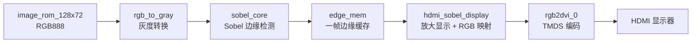
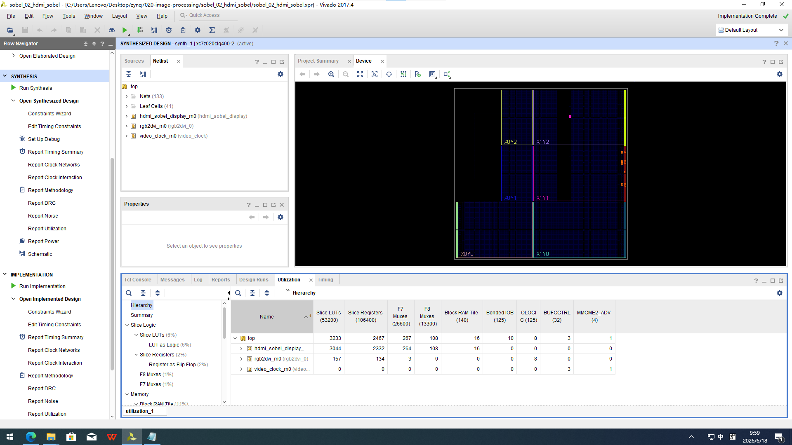
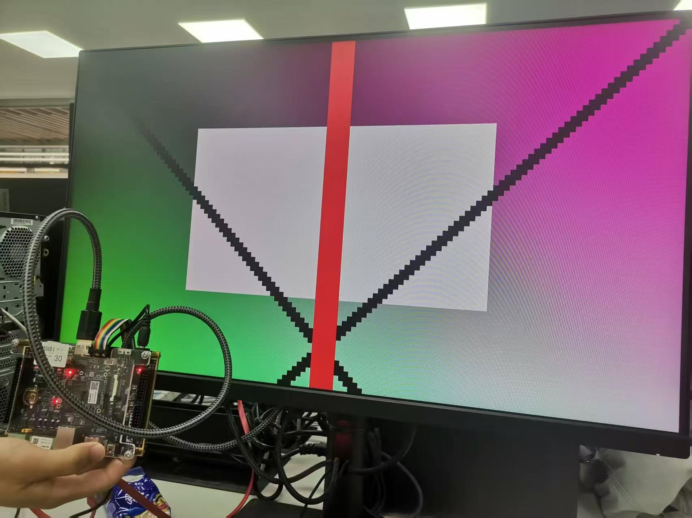
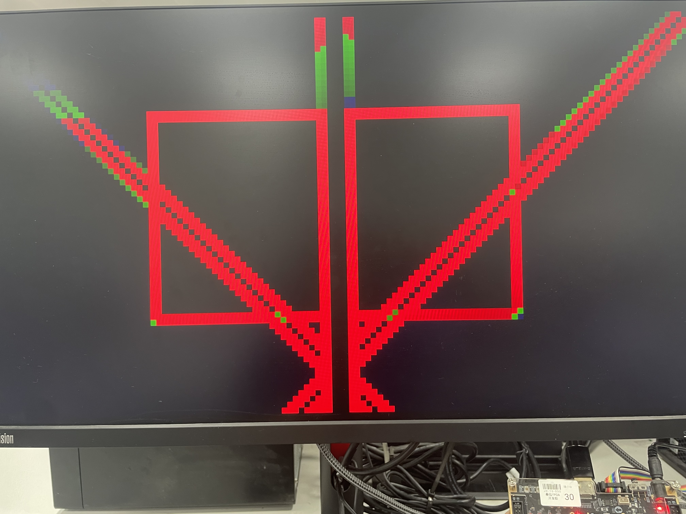

# sobel_02_hdmi_sobel 实验报告（基础 + 扩展版）

本文档用于系统说明本实验的设计思路、工程结构、实验过程、结果分析与拓展效果。

---

## 0. 实验背景与总体说明

本实验在 HDMI 固定图片显示的基础上，加入了灰度转换与 Sobel 边缘检测模块。实验目标是通过 PL 端实现从固定图像 ROM 读取 RGB 数据、完成灰度化处理、提取图像边缘，并将结果通过 HDMI 输出显示。

本实验不仅要求实现基础边缘检测效果，还要求理解拓展模式下的显示变化，即：

- 默认模式：黑底白边的灰度边缘显示；
- 扩展一：白底黑边显示；
- 扩展二：红/绿/蓝伪彩色边缘标记显示。

---

## 1. 实验目标与原理说明

### 1.1 实验目标

通过本实验，学生应能够：

1. 说明固定图片 ROM 如何提供 128×72 的 RGB888 输入数据。
2. 解释 `rgb_to_gray` 模块的灰度转换原理及其作用。
3. 说明 Sobel 算子如何提取图像边缘，并理解输出边缘强度的含义。
4. 理解 `edge_mem` 在一帧图像缓存中的作用。
5. 说明 `hdmi_sobel_display` 如何将 128×72 的边缘图放大到 1280×720 的显示画面。
6. 理解 `DISPLAY_MODE` 参数如何切换不同显示效果。

### 1.2 数据流说明



数据尺寸关系如下：

- 输入图像：128 × 72 RGB888
- Sobel 输出：128 × 72 的 8-bit 边缘强度
- HDMI 输出：1280 × 720
- 放大倍数：10 × 10

### 1.3 关键控制信号说明

从源码可以看出，整个链路依赖以下控制信号：

- `frame_start`：表示开始处理一帧图像。
- `gray_valid`：表示灰度结果有效。
- `edge_valid`：表示 Sobel 输出有效。
- `edge_frame_done`：表示一帧边缘处理完成。
- `sobel_done`：表示边缘结果已准备好进行显示。

---

## 2. 工程环境与文件说明

### 2.1 工程环境

- 开发工具：Vivado
- 目标平台：Zynq-7000 系列 FPGA
- 输出接口：HDMI
- 输入来源：固定图片 ROM
- 目标结果：HDMI 上显示边缘检测结果

### 2.2 工程文件说明

本工程的核心文件如下：

| 文件 | 作用 | 说明 |
| --- | --- | --- |
| [sobel_02_hdmi_sobel.xpr](sobel_02_hdmi_sobel.xpr) | Vivado 工程文件 | 管理整个 FPGA 工程配置 |
| [add_sobel_sources.tcl](add_sobel_sources.tcl) | 源码导入脚本 | 用于在 Vivado 中自动加入相关源码 |
| [top.v](sobel_02_hdmi_sobel.srcs/sources_1/new/top.v) | 顶层模块 | 连接视频时钟、HDMI 输出 IP 和显示模块 |
| [hdmi_sobel_display.v](sobel_02_hdmi_sobel.srcs/sources_1/new/hdmi_sobel_display.v) | HDMI 显示控制模块 | 负责扫描输出画面、读 `edge_mem` 并映射 RGB |
| [image_rom_128x72.v](sobel_02_hdmi_sobel.srcs/sources_1/new/image_rom_128x72.v) | 固定图片 ROM | 存储 128×72 的测试图像数据 |
| [rgb_to_gray.v](sobel_02_hdmi_sobel.srcs/sources_1/new/rgb_to_gray.v) | RGB 转灰度模块 | 将 RGB888 转换为 8 位灰度 |
| [sobel_core.v](sobel_02_hdmi_sobel.srcs/sources_1/new/sobel_core.v) | Sobel 边缘检测核心 | 计算水平和垂直梯度，并生成边缘强度 |
| [hdmi_out_test.xdc](sobel_02_hdmi_sobel.srcs/constrs_1/new/hdmi_out_test.xdc) | 管脚约束文件 | 定义 HDMI 输出相关引脚 |

### 2.3 重点模块功能说明

- [image_rom_128x72.v](sobel_02_hdmi_sobel.srcs/sources_1/new/image_rom_128x72.v)
  - 通过 `addr` 读取固定图像像素。
  - 输出为 24-bit RGB 数据，即 `R[7:0] G[7:0] B[7:0]`。

- [rgb_to_gray.v](sobel_02_hdmi_sobel.srcs/sources_1/new/rgb_to_gray.v)
  - 使用加权方法进行灰度转换。
  - 公式可理解为：灰度 ≈ 0.299R + 0.587G + 0.114B。

- [sobel_core.v](sobel_02_hdmi_sobel.srcs/sources_1/new/sobel_core.v)
  - 采用 3×3 Sobel 模板进行边缘检测。
  - 通过水平和垂直梯度计算边缘强度。
  - 输出 `edge_valid`、`edge_data`、`edge_x`、`edge_y`。

- [hdmi_sobel_display.v](sobel_02_hdmi_sobel.srcs/sources_1/new/hdmi_sobel_display.v)
  - 负责生成 HDMI 行场同步与有效显示信号。
  - 根据当前像素位置读取 `edge_mem` 中的数据。
  - 根据 `DISPLAY_MODE` 切换显示效果。

---

## 3. 更清晰的实验步骤

### 3.1 打开 Vivado 工程

打开工程文件：

- [sobel_02_hdmi_sobel.xpr](sobel_02_hdmi_sobel.xpr)

确认工程中已包含以下文件：

- [top.v](sobel_02_hdmi_sobel.srcs/sources_1/new/top.v)
- [hdmi_sobel_display.v](sobel_02_hdmi_sobel.srcs/sources_1/new/hdmi_sobel_display.v)
- [rgb_to_gray.v](sobel_02_hdmi_sobel.srcs/sources_1/new/rgb_to_gray.v)
- [sobel_core.v](sobel_02_hdmi_sobel.srcs/sources_1/new/sobel_core.v)
- [image_rom_128x72.v](sobel_02_hdmi_sobel.srcs/sources_1/new/image_rom_128x72.v)
- [hdmi_out_test.xdc](sobel_02_hdmi_sobel.srcs/constrs_1/new/hdmi_out_test.xdc)

如果其中的源码没有成功加入工程，可在 Tcl Console 中执行：

```tcl
cd <工程目录>
source add_sobel_sources.tcl
```

### 3.2 确认顶层模块

确认顶层模块为：

```text
top
```

如果顶层设置不正确，可在 Sources 中右键点击 [top.v](sobel_02_hdmi_sobel.srcs/sources_1/new/top.v)，选择 “Set as Top”。

### 3.3 检查关键数据流

重点观察 [hdmi_sobel_display.v](sobel_02_hdmi_sobel.srcs/sources_1/new/hdmi_sobel_display.v) 中的主要逻辑：

1. 生成 HDMI 时序信号（`h_cnt`、`v_cnt`）
2. 根据显示位置计算 `disp_x`、`disp_y`
3. 从 `edge_mem` 中读取当前像素值
4. 根据 `DISPLAY_MODE` 决定输出 RGB 映射关系
5. 通过 `video_on` 控制有效显示区域

同时需要注意 `edge_valid` 到 `edge_mem` 的写入过程：

- 当 `edge_valid` 有效时，`edge_data` 会写入对应的 `edge_wr_addr`。
- `edge_frame_done` 用于标记一帧处理完成。

### 3.4 综合与实现

在 Vivado 中依次完成：

1. Run Synthesis
2. Run Implementation
3. Generate Bitstream

完成后需要记录：

- 资源利用率
- 时序报告结果
- 生成出的 bitstream 文件位置

### 3.5 下载并验证

1. 连接开发板、HDMI 显示器与 JTAG。
2. 打开 Hardware Manager。
3. 连接目标板。
4. 选择生成的 bitstream 文件进行下载。

### 3.6 观察实际显示效果

将程序下载后，HDMI 屏幕上应显示固定图片经过 Sobel 处理后的边缘结果。

---

## 4. 预期现象与结果分析思路

### 4.1 预期现象

正常运行时，显示器上应出现：

- 固定图片轮廓清晰地显示为边缘图。
- 默认模式下表现为黑底白边的灰度边缘效果。
- 边缘越强，显示越亮。
- 图像以 1280×720 的分辨率完整显示。

若切换到拓展模式，则应分别观察到：

- 白底黑边效果；
- 红/绿/蓝伪彩色边缘标记效果。

### 4.2 结果分析思路

实验结果可以从以下几个方面进行分析：

1. 显示效果是否与预期一致。
2. 边缘轮廓是否连续、清晰。
3. 不同拓展模式下，边缘强弱是否能被正确区分。
4. 图像是否稳定地显示在 HDMI 上，而不是出现闪烁或全黑情况。

---

## 5. 常见问题与注意事项

### 5.1 HDMI 显示全黑

可能原因与检查项：

- `sobel_done` 是否最终置 1；
- `edge_mem` 是否存在有效写入；
- [rgb_to_gray.v](sobel_02_hdmi_sobel.srcs/sources_1/new/rgb_to_gray.v) 与 [sobel_core.v](sobel_02_hdmi_sobel.srcs/sources_1/new/sobel_core.v) 是否被正确加入工程；
- 是否重新执行了 Generate Bitstream。

### 5.2 显示器无信号

如果 HDMI 基础链路不正常，可先回到之前的固定图片显示实验验证；若基础链路正常，再检查：

- 顶层模块是否为 `top`；
- 约束文件是否正确加载；
- 时钟 IP 是否配置正确。

### 5.3 边缘效果不明显

可能原因：

- 输入图片本身边界不明显；
- Sobel 阈值或显示映射方式影响对比度；
- 图像放大后视觉效果不够清晰。

建议：

- 对比先前仿真或基础实验结果；
- 调整显示模式或阈值参数；
- 确认 `edge_mem` 的读写时序正确。

### 5.4 修改后需要重新生成

每次修改 [hdmi_sobel_display.v](sobel_02_hdmi_sobel.srcs/sources_1/new/hdmi_sobel_display.v) 后，都要重新执行：

- Run Synthesis
- Run Implementation
- Generate Bitstream

---

## 6. 本实验的拓展方案说明

本实验的拓展建议控制在一个 Verilog 文件或一个参数修改范围内，重点验证显示效果的变化，而不改变整体顶层结构。

### 6.1 扩展一：边缘反色显示（白底黑边）

- 目标：将原有的黑底白边效果改为白底黑边效果。
- 修改方式：设置 `DISPLAY_MODE = 2'd1`。
- 原理：将 `edge_pixel` 按位取反，实现 `255 - edge_pixel` 的映射关系。

### 6.2 扩展二：彩色边缘标记（红/绿/蓝伪彩色）

- 目标：按照边缘强弱分别显示红、绿、蓝。
- 修改方式：设置 `DISPLAY_MODE = 2'd2`。
- 阈值参数：
  - `EDGE_THRESH_HIGH = 8'd192`
  - `EDGE_THRESH_MED  = 8'd96`

### 6.3 拓展总结

以上两种拓展都只涉及显示映射逻辑，不需要更换顶层模块，也不需要修改时序控制逻辑，因此可以很方便地对比不同显示效果。

---

## 7. 实验结果展示（Vivado 资源利用率、时序结果、bitstream 与 HDMI 实验效果）

本部分用于记录实验过程中实际获得的结果图与运行截图，并与预期现象进行对照分析。

### 7.1 资源利用率截图



### 7.2 基础实验 HDMI 结果图



### 7.3 扩展一：白底黑边结果图


### 7.4 扩展二：红/绿/蓝伪彩色结果图



---

## 8. 实验总结

通过本实验，完成了从固定图片 ROM 读取数据、RGB 转灰度、Sobel 边缘提取、边缘结果缓存以及 HDMI 显示的完整流程。实验不仅验证了基础边缘检测功能，还通过参数切换实现了白底黑边和红/绿/蓝伪彩色两种拓展显示效果。

在实验报告中，应重点记录：

1. Sobel 边缘检测的输入输出关系；
2. 灰度转换的原理与意义；
3. `edge_mem` 的作用与缓存时机；
4. HDMI 显示放大的原理；
5. 各种显示模式下的效果差异。
