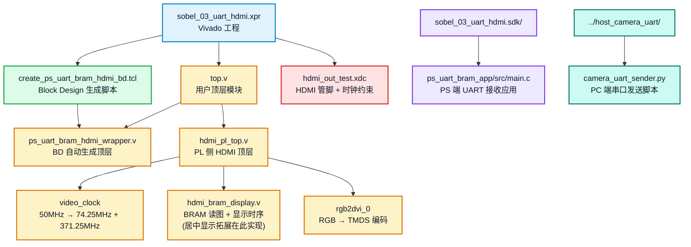
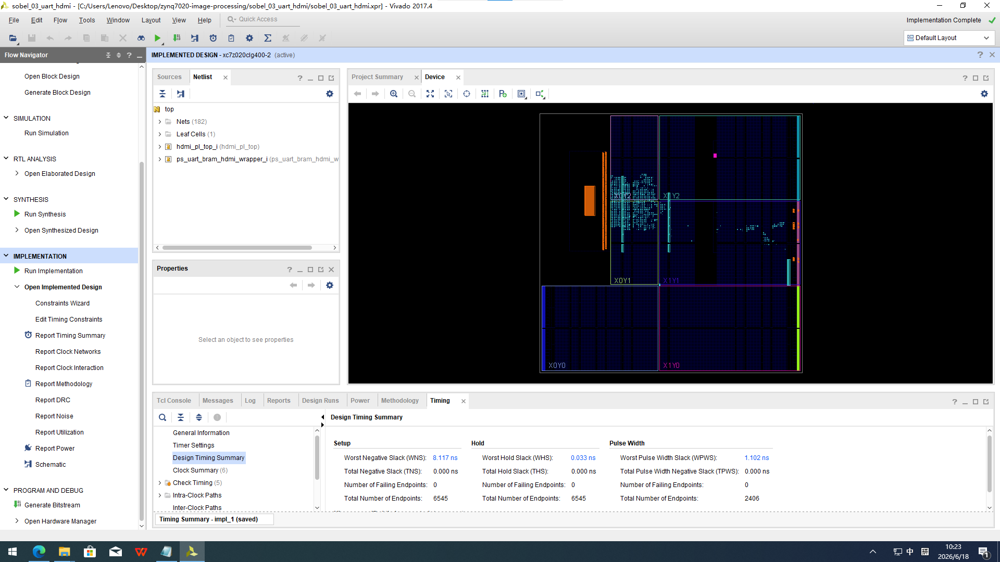
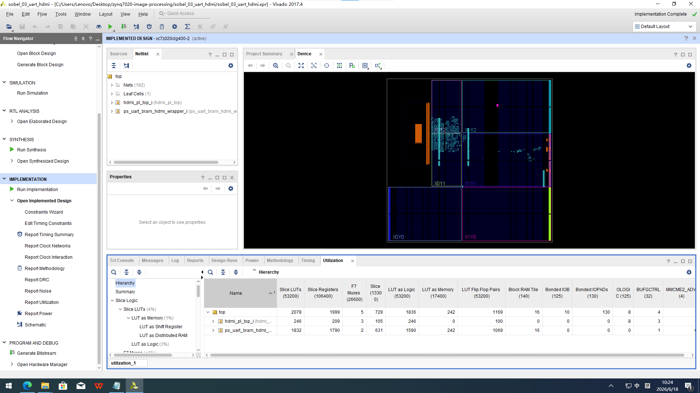

# sobel_03_uart_hdmi 实验报告

## 实验目标

本实验的目标是验证 **PC 端 → 串口 → ZYNQ PS → AXI BRAM → PL HDMI 显示器** 的完整图像传输与显示链路。具体包括：

1. **串口图像接收**：PC 端通过 USB 串口（115200 baud）发送图像数据，ZYNQ PS 端通过 UART 接收并解析帧协议。
2. **BRAM 帧缓存写入**：PS 将解析后的 RGB888 像素数据通过 AXI GP0 → SmartConnect → AXI BRAM Controller 写入 Block RAM（地址 0x40000000）。
3. **PL 端 HDMI 显示**：PL 端通过 BRAM PORTB 独立读取 BRAM 中的图像数据，经 RGB2DVI 编码后输出 HDMI 信号到显示器。
4. **BRAM 双端口共享验证**：验证 PS 写 BRAM（PORTA）与 PL 读 BRAM（PORTB）可同时工作，实现"PS 写入一帧、PL 实时显示"的共享内存架构。
5. **HDMI 显示扩展**：在基础显示功能之上，实现图像居中显示功能——将 128×72 原始分辨率图像以 1 倍缩放居中显示在 1280×720 画面中央，其余区域填充黑色背景。

本实验是 Sobel 图像处理系列的 **基础验证环节**，不包含 Sobel 滤波算法。当前版本使用 `128×72` 分辨率 RGB888 图像。

**本实验已完成的拓展：调整图像居中显示。** 具体实现见"已完成的拓展"章节。

---

## 实验数据流

### 整体数据流

```mermaid
flowchart LR
    pc["PC 摄像头 / 图片"] --> uart["USB 串口<br/>115200 baud"]
    uart --> ps_uart["ZYNQ PS UART1<br/>MIO 48..49"]
    ps_uart --> parser["PS 软件解析帧数据<br/>帧头 → 行头 → RGB 像素"]
    parser --> axi["AXI GP0 Master"]
    axi --> smart["SmartConnect"]
    smart --> ctrl["AXI BRAM Controller<br/>Base: 0x40000000"]
    ctrl --> porta["BRAM PORTA<br/>PS 写端"]
    porta --> bram["Block RAM<br/>True Dual Port<br/>64KB (16384×32bit)"]
    bram --> portb["BRAM PORTB<br/>PL 读端"]
    portb --> pl["hdmi_bram_display<br/>BRAM 读图 + 坐标映射<br/>1x 居中显示 + 黑色背景"]
    pl --> dvi["RGB2DVI<br/>TMDS 编码"]
    dvi --> hdmi["HDMI 显示器<br/>1280×720@60Hz"]

    classDef pc fill:#dcfce7,stroke:#16a34a,color:#0f172a,stroke-width:2px;
    classDef ps fill:#e0f2fe,stroke:#0284c7,color:#0f172a,stroke-width:2px;
    classDef axi fill:#ede9fe,stroke:#7c3aed,color:#0f172a,stroke-width:2px;
    classDef pl fill:#fef3c7,stroke:#d97706,color:#0f172a,stroke-width:2px;
    classDef out fill:#fae8ff,stroke:#c026d3,color:#0f172a,stroke-width:2px;
    class pc,uart pc;
    class ps_uart,parser ps;
    class axi,smart,ctrl,porta,bram,portb axi;
    class pl,dvi pl;
    class hdmi out;
```



### 数据格式与存储

| 环节 | 数据格式 | 说明 |
| --- | --- | --- |
| 串口传输 | 8N1, 115200 baud | 每字节 1 起始位 + 8 数据位 + 1 停止位 |
| 帧头 | `0x55 0xAA width_l width_h height_l height_h format` | 7 字节，format = 0x18 (RGB888) |
| 行头 | `0x33 0xCC row_l row_h` | 4 字节/行，row = 0..71 |
| 像素数据 | `R G B` (每像素 3 字节) | 128 像素/行 × 72 行 = 27648 字节/帧 |
| BRAM 存储 | `0x00RRGGBB` (32bit/像素) | 地址 = 0x40000000 + ((y×128 + x) << 2) |
| PL 读取 | BRAM PORTB, 74.25MHz 时钟 | 只读, BRAM DOUT[23:0] → RGB888 |
| HDMI 输出 | 1280×720@60Hz, TMDS | 1x 原始分辨率居中显示，背景黑色 |

### BRAM 地址映射

```text
BRAM base address = 0x40000000
BRAM range        = 64 KB (16384 × 32bit)

帧缓存布局:
  Pixel(0,0)   → 0x40000000
  Pixel(1,0)   → 0x40000004
  ...
  Pixel(127,0) → 0x400001FC
  Pixel(0,1)   → 0x40000200
  ...
  Pixel(127,71)→ 0x400047FC
```

---

## 工程文件说明

### 工程概览

| 文件 | 类型 | 说明 |
| --- | --- | --- |
| `sobel_03_uart_hdmi.xpr` | Vivado 工程 | Vivado 2017.4 工程文件 |
| `create_ps_uart_bram_hdmi_bd.tcl` | Tcl 脚本 | Block Design 自动生成脚本 |
| `top.v` | Verilog | 顶层模块，连接 Block Design wrapper 与 HDMI PL 顶层 |
| `hdmi_pl_top.v` | Verilog | PL 侧 HDMI 显示顶层，例化 clock / display / rgb2dvi |
| `hdmi_bram_display.v` | Verilog | **核心模块**：BRAM 读图 + 1280×720 时序 + 缩放/定位/边框 |
| `hdmi_bram_display - 副本.v` | Verilog | 旧版备份（简化版居中实现，参数较少） |
| `hdmi_out_test.xdc` | XDC 约束 | HDMI 管脚约束 + 系统时钟约束 |
| `ps_uart_bram_app/src/main.c` | C (SDK) | PS 端 UART 接收 + BRAM 写入应用 |
| `sobel_03_uart_hdmi.sdk/` | SDK 工作区 | 包含 hw_platform / BSP / 应用工程 |
| `../hdmi_common/` | 共享库 | Sobel 系列共用 HDMI IP (video_clock, rgb2dvi, xdc) |
| `../host_camera_uart/` | Python | PC 端串口图像发送脚本 |

### 文件依赖关系



### 关键模块详解

#### top.v — 顶层连接

将 Block Design 生成的 `ps_uart_bram_hdmi_wrapper` 与 PL 侧 `hdmi_pl_top` 通过 BRAM PORTB 信号对接。BRAM 的 clk/rst/en/we/addr/din/dout 信号全部从 wrapper 引出到 `hdmi_pl_top`。

```verilog
// top.v 核心连接结构
ps_uart_bram_hdmi_wrapper ps_uart_bram_hdmi_wrapper_i (
    .BRAM_PORTB_addr(bram_addr),
    .BRAM_PORTB_clk(bram_clk),
    .BRAM_PORTB_dout(bram_dout),
    // ... DDR, FIXED_IO ...
);

hdmi_pl_top hdmi_pl_top_i (
    .sys_clk(sys_clk),
    .hdmi_oen(hdmi_oen),
    .TMDS_clk_n(TMDS_clk_n),
    .TMDS_clk_p(TMDS_clk_p),
    .TMDS_data_n(TMDS_data_n),
    .TMDS_data_p(TMDS_data_p),
    // BRAM PORTB 信号对接
    .bram_clk(bram_clk),
    .bram_addr(bram_addr),
    .bram_dout(bram_dout),
    // ...
);
```

#### hdmi_pl_top.v — PL 显示顶层

- **video_clock**：将 50MHz 系统时钟倍频为 74.25MHz（像素时钟）和 371.25MHz（5× 串行时钟）
- **hdmi_bram_display**：产生 1280×720@60Hz 时序，从 BRAM 读取图像数据，**实现居中显示功能（本实验拓展的核心）**
- **rgb2dvi_0**：将 RGB 像素 + 同步信号编码为 TMDS 差分信号
- **复位同步**：video_locked 信号通过 4 级移位寄存器释放复位，确保时钟稳定后各模块才工作

#### hdmi_bram_display.v — 核心显示模块（拓展修改位置）

本模块是本实验的核心显示模块，也是**拓展功能的实现位置**。模块通过以下可参数化设计实现图像居中显示：

**模块当前配置（拓展后的状态）：**

| 参数 | 默认值 | 说明 |
| --- | --- | --- |
| `SCALE_X` | `4'd1` | X 方向放大倍数 (1~10)，当前 1x 原始尺寸 |
| `SCALE_Y` | `4'd1` | Y 方向放大倍数 (1~10)，当前 1x 原始尺寸 |
| `POSITION_MODE` | `2'b01` | 定位模式：00=左上角 · **01=居中（当前使用）** · 10=自定义偏移 |
| `OFFSET_X` | `12'd0` | 自定义 X 偏移（仅 POSITION_MODE=2'b10 时有效） |
| `OFFSET_Y` | `12'd0` | 自定义 Y 偏移（仅 POSITION_MODE=2'b10 时有效） |
| `BORDER_ENABLE` | `1'b0` | 边框开关（当前关闭） |
| `BORDER_WIDTH` | `5'd4` | 边框宽度（0~31 像素） |
| `BORDER_COLOR` | `24'hFF0000` | 边框颜色（红） |
| `BG_COLOR` | `24'h000000` | **背景颜色，当前黑色——图像外围填充此色** |

HDMI 时序参数：1280×720@60Hz，像素时钟 74.25MHz，行总周期 1650，场总周期 750。

**居中显示的坐标映射核心逻辑：**

```
显示尺寸: IMG_DISP_W = 128 × SCALE_X = 128 × 1 = 128
          IMG_DISP_H = 72  × SCALE_Y = 72  × 1 = 72

图像原点 (当 POSITION_MODE=2'b01 居中):
  IMG_X0 = (1280 - 128) / 2 = 576
  IMG_Y0 = (720  - 72)  / 2 = 324

图像区域: [576, 576+128) × [324, 324+72) = [576, 704) × [324, 396)
```

对应的 Verilog 代码：

```verilog
// hdmi_bram_display.v 中的定位逻辑（第 75-80 行）
localparam [11:0] IMG_X0 = (POSITION_MODE == 2'b01) ? ((H_ACTIVE - IMG_DISP_W) / 2) :
                           (POSITION_MODE == 2'b10) ? OFFSET_X : 12'd0;
localparam [11:0] IMG_Y0 = (POSITION_MODE == 2'b01) ? ((V_ACTIVE - IMG_DISP_H) / 2) :
                           (POSITION_MODE == 2'b10) ? OFFSET_Y : 12'd0;
localparam [11:0] IMG_X1 = IMG_X0 + IMG_DISP_W;
localparam [11:0] IMG_Y1 = IMG_Y0 + IMG_DISP_H;
```

**像素输出优先级（第 143-150 行）：**

```verilog
// 优先级: 图像 > 边框 > 背景 > 消隐期黑
assign rgb_r = de_d1 ? (img_vld_d1 ? pixel_d1[23:16] :
                        bdr_vld_d1 ? BORDER_COLOR[23:16] : BG_COLOR[23:16]) : 8'h00;
assign rgb_g = de_d1 ? (img_vld_d1 ? pixel_d1[15:8]  :
                        bdr_vld_d1 ? BORDER_COLOR[15:8]  : BG_COLOR[15:8])  : 8'h00;
assign rgb_b = de_d1 ? (img_vld_d1 ? pixel_d1[7:0]   :
                        bdr_vld_d1 ? BORDER_COLOR[7:0]   : BG_COLOR[7:0])   : 8'h00;
```

- 图像区域内 → 输出 BRAM 像素数据
- 边框区域内 → 输出 `BORDER_COLOR`
- 其余有效区 → 输出 `BG_COLOR`（黑色背景）
- 消隐期 → 输出黑色 (0x00)

**流水线对齐机制：**

BRAM 读取有 1 个时钟周期的延迟，所有控制信号经过统一 3 级流水线确保同步：

```
Cycle N(组合)  → Cycle N+1    → Cycle N+2    → Cycle N+3   → 输出
──────────────────────────────────────────────────────────────────
vid_act       → de_r        → de_d        → de_d1       → DE 脚
img_valid     → img_vld_r   → img_vld_d   → img_vld_d1  → 选图 / 背景
bdr_valid     → bdr_vld_r   → bdr_vld_d   → bdr_vld_d1  → 选边框 / 背景
bram_addr_r   → [BRAM 1clk] → pixel_d     → pixel_d1    → 像素 RGB 输出
hsync/vsync   → hs_r/vs_r   → hs_d/vs_d   → hs_d1/vs_d1 → HS/VS 脚
```

总延迟 3 个时钟周期，画面整体右移 3 像素（肉眼不可见）。

#### main.c — PS 端应用

- **初始化**：配置 UART1 (115200 8N1)，查找 BRAM 基地址
- **启动测试图案**：`fill_test_pattern()` 写入渐变 + 白色边框测试图案，验证 HDMI 链路
- **帧接收循环**：`receive_frame()` 等待帧头 `0x55 0xAA`，校验图像尺寸和格式，按行接收 RGB 像素，逐像素写入 BRAM
- **错误处理**：超时、行号不匹配、数据丢失等均有对应错误码（-1 到 -7）

### 串口协议

#### 帧格式

```
帧头 (7 bytes):  0x55 0xAA width_l width_h height_l height_h format
行头 (4 bytes):  0x33 0xCC row_l row_h           ← 每行前发送
像素 (384 bytes): R0 G0 B0 R1 G1 B1 ... R127 G127 B127  ← 每行 128×3 字节
```

| 字段 | 字节数 | 值 | 说明 |
| --- | --- | --- | --- |
| 帧同步 | 2 | `0x55 0xAA` | 帧起始标识 |
| width | 2 | `128` | 图像宽度 (little-endian) |
| height | 2 | `72` | 图像高度 (little-endian) |
| format | 1 | `0x18` | RGB888 格式标识 |
| 行同步 | 2 | `0x33 0xCC` | 行起始标识 |
| row | 2 | `0..71` | 行号 (little-endian) |
| 像素 | 384 | R,G,B 循环 | 128 像素 × 3 通道 |

---

## 详细实验步骤

### 步骤 1：打开并配置 Vivado 工程

1. 打开 Vivado 2017.4
2. 打开工程：
   ```
   F:\zynq7020-image-processing\sobel_03_uart_hdmi\sobel_03_uart_hdmi.xpr
   ```
3. 确认以下关键文件存在且 `top` 为顶层模块：
   - `top.v` 为顶层
   - `hdmi_pl_top.v` 和 `hdmi_bram_display.v` 已添加到工程
   - `hdmi_out_test.xdc` 约束文件已启用
4. 确认 Block Design (`ps_uart_bram_hdmi`) 存在且包含：
   - ZYNQ7 Processing System
   - SmartConnect
   - AXI BRAM Controller
   - Block Memory Generator (True Dual Port)

**如果需要重新生成 Block Design：**

在 Vivado Tcl Console 中执行：
```tcl
cd F:/zynq7020-image-processing/sobel_03_uart_hdmi
source create_ps_uart_bram_hdmi_bd.tcl
```

### 步骤 2：生成 Bitstream

在 Vivado 中依次执行：
```
Run Synthesis → Run Implementation → Generate Bitstream
```

- 确认没有关键 DRC 错误
- Bitstream 路径：`sobel_03_uart_hdmi.runs/impl_1/top.bit`

### 步骤 3：下载 Bitstream 到开发板

1. 连接开发板电源、JTAG 下载器、HDMI 显示器、USB 串口线
2. 在 Vivado 中：`Program and Debug → Open Hardware Manager → Open Target → Auto Connect`
3. `Program Device` → 选择 `top.bit` → 下载
4. 下载完成后，观察 HDMI 显示器是否有信号（此时为黑色画面）

### 步骤 4：配置 SDK 工程

1. SDK 工作区目录：
   ```
   F:\zynq7020-image-processing\sobel_03_uart_hdmi\sobel_03_uart_hdmi.sdk
   ```
2. Project Explorer 中确认存在：
   - `top_hw_platform_0` — 硬件平台
   - `ps_uart_bram_app_bsp` — BSP 工程
   - `ps_uart_bram_app` — PS 端应用工程
3. 重新生成 BSP：`右键 ps_uart_bram_app_bsp → Re-generate BSP Sources`
4. 编译应用：`右键 ps_uart_bram_app → Clean Project` → `右键 ps_uart_bram_app → Build Project`

### 步骤 5：运行 PS 程序并验证串口输出

1. 确保 bitstream 已下载（FPGA 已配置）
2. 运行 PS 程序：`右键 ps_uart_bram_app → Run As → Launch on Hardware (System Debugger)`
3. 打开串口调试助手，配置：

   | 参数 | 值 |
   | --- | --- |
   | 端口号 | 根据实际 COM 口选择（如 COM7） |
   | 波特率 | 115200 |
   | 数据位 | 8 |
   | 校验位 | None |
   | 停止位 | 1 |
   | 流控 | None |

4. 确认串口输出：

   ```
   PS UART BRAM HDMI display
   BRAM base: 0x40000000, baud: 115200
   waiting for frame header
   ```

5. 此时 HDMI 显示器应显示 PS 程序写入的**默认测试图案**（RGB 渐变 + 白色边框，128×72 居中显示在黑色背景中央）

### 步骤 6：配置 PC 端 Python 环境

1. 安装 Anaconda（如已安装跳过）

2. 打开 Anaconda Prompt，创建虚拟环境：
   ```bash
   conda create -n fpga python=3.13 -y
   conda activate fpga
   ```

3. 进入 PC 端脚本目录并安装依赖：
   ```bash
   cd F:\zynq7020-image-processing\host_camera_uart
   python -m pip install --upgrade pip
   pip install -r requirements.txt
   ```

4. 验证环境：
   ```bash
   python -c "import cv2, numpy, serial; print('ok')"
   ```
   输出 `ok` 表示环境就绪。

### 步骤 7：发送图像并验证完整链路

> **重要**：发送图像前，必须先**关闭串口调试助手**，否则 COM 口被占用导致 Python 脚本无法打开串口。

#### 方式一：摄像头实时发送

```bash
conda activate fpga
cd F:\zynq7020-image-processing\host_camera_uart
python camera_uart_sender.py --port COM7 --baud 115200 --camera 0 --fps 0.2 --preview
```

参数说明：
- `--port`：开发板对应的串口号
- `--baud`：必须与 SDK 程序一致（115200）
- `--camera 0`：使用默认摄像头
- `--fps 0.2`：每 5 秒发送 1 帧（适配 115200 波特率）
- `--preview`：PC 端显示预览窗口

#### 方式二：单张图片发送

```bash
python camera_uart_sender.py --port COM7 --baud 115200 --image test.jpg --once --preview
```

#### 方式三：增加行间延时（防丢帧）

```bash
python camera_uart_sender.py --port COM7 --baud 115200 --camera 0 --fps 0.2 --line-delay 0.001 --preview
```

### 步骤 8：保存实验结果

1. 拍摄 HDMI 显示器画面照片
2. 截取串口输出（包含启动信息和帧接收日志）
3. 截取 Vivado 资源利用率（Synthesis / Implementation 报告）
4. 截取 Vivado 时序报告（确认无时序违规）

---

## 预期实验现象

### 基础实验正常现象

| 阶段 | 预期现象 | 判断标准 |
| --- | --- | --- |
| 下载 bitstream 后 | HDMI 显示器亮起（黑屏） | 显示器检测到 HDMI 信号 |
| PS 程序启动 | 串口输出启动信息 | 打印 `PS UART BRAM HDMI display` 及 BRAM 地址 |
| PS 程序等待 | 串口打印 `waiting for frame header` | 表示 UART 就绪、等待 PC 端发送 |
| 测试图案显示 | HDMI 显示彩色渐变 + 白色边框，128×72 图像居中显示在黑色背景中 | `fill_test_pattern()` 写入的图案正确渲染 |
| PC 端发送图像 | HDMI 画面更新为 PC 端发送的图像 | 摄像头图像或图片出现在 HDMI 显示器中央 |
| 连续传输 | 每收到约 32 帧打印一次 `received N frames` | 证明持续稳定接收、无帧错误 |
| 画面完整性 | 显示图像无撕裂、无错位、无花屏，图像外围为纯黑色背景 | 居中定位正确，背景色填充正确 |

> **📷 插入基础实验图片：**
>
> 
>
> 
>
> 

### 串口输出示例

**正常启动：**

```
PS UART BRAM HDMI display
BRAM base: 0x40000000, baud: 115200
waiting for frame header
```

**正常接收（每 32 帧报告一次）：**
```
received 32 frames
received 64 frames
received 96 frames
```

### 异常现象与排查

| 现象 | 可能原因 | 排查方法 |
| --- | --- | --- |
| 串口无任何输出 | PS 程序未运行 / 串口号错误 / 串口被占用 | 确认 Program FPGA + Run PS 程序，检查 COM 口和 115200 8N1 |
| HDMI 无输出（黑屏） | 显示器输入源 / bitstream 未下载 / 约束错误 | 检查显示器 HDMI 输入源，确认下载最新 `top.bit` |
| 一直打印 `waiting for frame header` | PC 端未发送 / 串口被占用 | 关闭串口助手，运行 Python 发送脚本 |
| `frame error -1` | 图像宽度、高度或格式不匹配 | 确认 PC 端发送 128×72 RGB888（format=0x18） |
| `frame error -2` | 行号不匹配，串口丢数据 | 降低 `--fps`，增加 `--line-delay` |
| `frame error -5` | 等待行头超时 | 同上，检查 USB 串口线连接 |
| `frame error -6` | 等待行号超时 | 同上 |
| `frame error -7` | 等待像素数据超时 | 同上 |
| HDMI 有输出但 PC 发送后不更新 | 串口被占用 / 波特率不一致 / PS 程序已停止 | 关闭串口助手，确认 `--baud 115200`，重新运行 PS 程序 |

### 帧率说明

| 项目 | 数值 |
| --- | --- |
| 串口波特率 | 115200 bps |
| UART 8N1 有效字节率 | ≈ 11520 byte/s |
| 一帧数据量 | 27648 字节（128×72×3） |
| 加帧头行头后每帧 | ≈ 28000 字节 |
| 理论最高帧率 | ≈ 0.41 fps |
| 建议发送帧率 | 0.2 fps（每 5 秒 1 帧） |

在当前 `115200` 波特率下，画面刷新较慢属正常现象。如需提高帧率，可后续提高波特率、减小分辨率或换用 USB/Ethernet/DMA 通道。

---

## 已完成的拓展：调整图像居中显示

### 拓展目标

将 `128×72` 原始分辨率图像从铺满全屏（10 倍放大）改为**原始尺寸居中显示**在 `1280×720` 画面中，图像外围填充黑色背景。同时增加可参数化的缩放、定位、边框和背景色功能，方便后续灵活调整显示效果。

### 修改文件

拓展所有修改集中在 `hdmi_bram_display.v`。更详细的实现细节请直接阅读该文件的源代码和注释。

### 实现原理

#### 1. 新增参数化设计

`hdmi_bram_display.v` 新增了以下显示控制参数，全部以 Verilog `parameter` 定义，支持在 `hdmi_pl_top.v` 中通过 `defparam` 覆盖：

| 参数 | 位宽 | 当前值 | 说明 |
| --- | --- | --- | --- |
| `SCALE_X` | 4 bit | `4'd1` | X 方向放大倍数（1~10），`128 × SCALE_X` = 显示宽度 |
| `SCALE_Y` | 4 bit | `4'd1` | Y 方向放大倍数（1~10），`72 × SCALE_Y` = 显示高度 |
| `POSITION_MODE` | 2 bit | `2'b01` | `00`=左上角 · **`01`=居中（当前使用）** · `10`=自定义 |
| `OFFSET_X` | 12 bit | `12'd0` | 自定义 X 偏移（仅 `POSITION_MODE = 2'b10` 时生效） |
| `OFFSET_Y` | 12 bit | `12'd0` | 自定义 Y 偏移（仅 `POSITION_MODE = 2'b10` 时生效） |
| `BG_COLOR` | 24 bit | `24'h000000` | 图像之外区域的背景填充色（黑色） |
| `BORDER_ENABLE` | 1 bit | `1'b0` | 边框总开关（当前关闭） |
| `BORDER_WIDTH` | 5 bit | `5'd4` | 边框宽度（0~31 像素） |
| `BORDER_COLOR` | 24 bit | `24'hFF0000` | 边框 RGB 颜色（红） |

#### 2. 坐标映射机制

所有定位参数在综合时折叠为常数，不消耗额外逻辑资源。居中定位的核心计算如下（见 `hdmi_bram_display.v` 第 71-80 行）：

```
显示尺寸: IMG_DISP_W = 128 × SCALE_X,  IMG_DISP_H = 72 × SCALE_Y

图像原点 (IMG_X0, IMG_Y0):
  MODE=00 左上:   (0, 0)
  MODE=01 居中:   ((1280 - IMG_DISP_W)/2,  (720 - IMG_DISP_H)/2)
  MODE=10 自定义:  (OFFSET_X, OFFSET_Y)

图像区域: [IMG_X0, IMG_X0+IMG_DISP_W) × [IMG_Y0, IMG_Y0+IMG_DISP_H)
```

当前配置（`SCALE_X=1, SCALE_Y=1, POSITION_MODE=2'b01`）的计算结果：

```
IMG_DISP_W = 128 × 1 = 128
IMG_DISP_H = 72  × 1 = 72
IMG_X0 = (1280 - 128) / 2 = 576   → 图像左边界在第 576 列
IMG_Y0 = (720  - 72)  / 2 = 324   → 图像上边界在第 324 行
```

#### 3. HDMI 像素坐标反向映射到 BRAM 地址

每个 HDMI 有效像素 `(ax, ay)` 先判断是否落在图像区域，再**反向映射**到原始图像坐标（见第 129-134 行）：

```verilog
// 图像有效区域判断
wire img_valid = (ax >= IMG_X0) && (ax < IMG_X1) &&
                 (ay >= IMG_Y0) && (ay < IMG_Y1);

// 反向映射到原始图像坐标（最近邻插值）
wire [6:0] img_x = (ax - IMG_X0) / SCALE_X;   // → 0…127
wire [6:0] img_y = (ay - IMG_Y0) / SCALE_Y;   // → 0…71
wire [13:0] img_word_addr = img_y * 128 + img_x;  // BRAM 字地址
```

#### 4. 像素输出选择（3 层优先级）

输出端以优先级选择像素来源（见第 143-150 行）：

```
优先级（由高到低）:
  img_vld_d1=1  → pixel_d1       (BRAM 图像像素)
  bdr_vld_d1=1  → BORDER_COLOR   (边框颜色，当前关闭)
  否则          → BG_COLOR       (背景颜色，黑色)
```

#### 5. 流水线对齐

BRAM 读取有 1 周期延迟。所有控制信号经统一 3 级流水线与 `de_d1`/`pixel_d1` 严格同步，消除画面错位和撕裂。

### 拓展效果示意

```
┌────────────────────── 1280 ──────────────────────┐
│                                                    │
│              黑色背景 (BG_COLOR=0x000000)           │
│                                                    │
│          ┌────────── 128 ──────────┐               │
│          │                         │               │
│          │    BRAM 图像 (128×72)    │    720        │
│          │    原始分辨率 居中显示    │               │
│          │                         │               │
│          └─────────────────────────┘               │
│           ↑ 576px 左侧黑边                         │
│                                                    │
└────────────────────────────────────────────────────┘
```

### 当前配置与效果

| 项目 | 值 | 视觉效果 |
| --- | --- | --- |
| 缩放 | 1x（原始 128×72） | 图像不放大，保持原始分辨率 |
| 位置 | 居中 | 图像位于屏幕正中央 |
| 图像区域 | [576, 704) × [324, 396) | 约占屏幕面积的 1% |
| 背景 | 黑色 (0x000000) | 图像外围全黑 |
| 边框 | 关闭 | 无边框线 |

> 

### 其他可选配置示例

如需切换显示效果，在 `hdmi_pl_top.v` 中使用 `defparam` 覆盖参数（代码中已预置注释示例）：

```verilog
// 示例 1: 1x 原始尺寸左上角显示
defparam hdmi_bram_display_m0.SCALE_X       = 4'd1;
defparam hdmi_bram_display_m0.SCALE_Y       = 4'd1;
defparam hdmi_bram_display_m0.POSITION_MODE = 2'b00;   // 左上角
defparam hdmi_bram_display_m0.BG_COLOR      = 24'h000000;

// 示例 2: 5x 放大 + 居中 + 红色 4px 边框
defparam hdmi_bram_display_m0.SCALE_X       = 4'd5;
defparam hdmi_bram_display_m0.SCALE_Y       = 4'd5;
defparam hdmi_bram_display_m0.POSITION_MODE = 2'b01;   // 居中
defparam hdmi_bram_display_m0.BORDER_ENABLE = 1'b1;
defparam hdmi_bram_display_m0.BORDER_WIDTH  = 5'd4;
defparam hdmi_bram_display_m0.BORDER_COLOR  = 24'hFF0000;
defparam hdmi_bram_display_m0.BG_COLOR      = 24'h000000;

// 示例 3: 10x 铺满全屏 (恢复原始全屏效果)
defparam hdmi_bram_display_m0.SCALE_X       = 4'd10;
defparam hdmi_bram_display_m0.SCALE_Y       = 4'd10;
defparam hdmi_bram_display_m0.POSITION_MODE = 2'b00;
```

> **注意**：`hdmi_bram_display.v` 和 `hdmi_pl_top.v` 中的注释包含了更详尽的配置说明和组合示例。关于流水线时序、边框区域裁剪、边界保护的更多细节，请参考源代码中的注释。


## 参考信息

| 项目 | 值 |
| --- | --- |
| 开发板 | ZYNQ-7020 |
| Vivado 版本 | 2017.4 |
| 图像分辨率 | 128 × 72 |
| 像素格式 | RGB888 |
| HDMI 分辨率 | 1280 × 720 @ 60Hz |
| 像素时钟 | 74.25 MHz |
| BRAM 基地址 | 0x40000000 |
| BRAM 容量 | 64 KB (16384 × 32 bit) |
| 串口 | UART1, MIO 48..49, 115200 8N1 |
| PS 时钟 | 50 MHz (FCLK_CLK0) |
| PL BRAM 读时钟 | 74.25 MHz (video_clk) |
| 当前缩放 | 1x（原始分辨率） |
| 当前显示位置 | 居中（POSITION_MODE=2'b01） |
| 当前背景色 | 黑色（BG_COLOR=24'h000000） |
| 共享目录 | `../hdmi_common/` (HDMI IP + 约束) |
| PC 脚本目录 | `../host_camera_uart/` |
