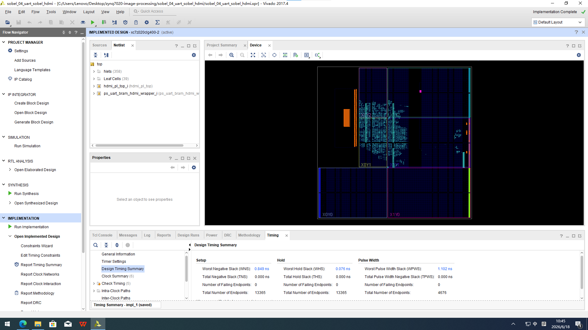
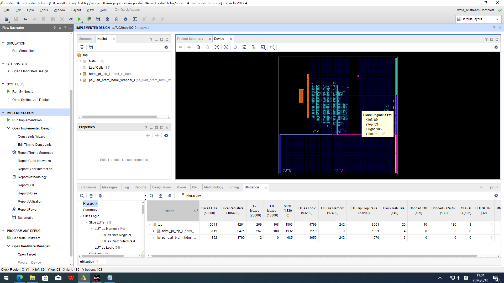
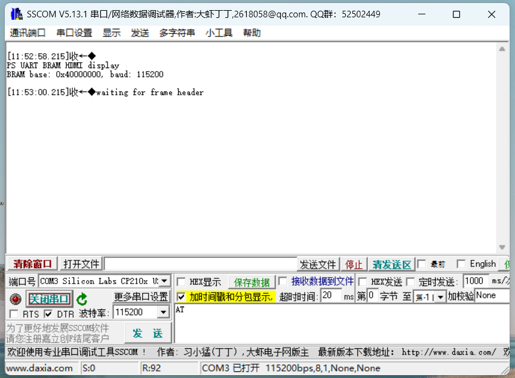
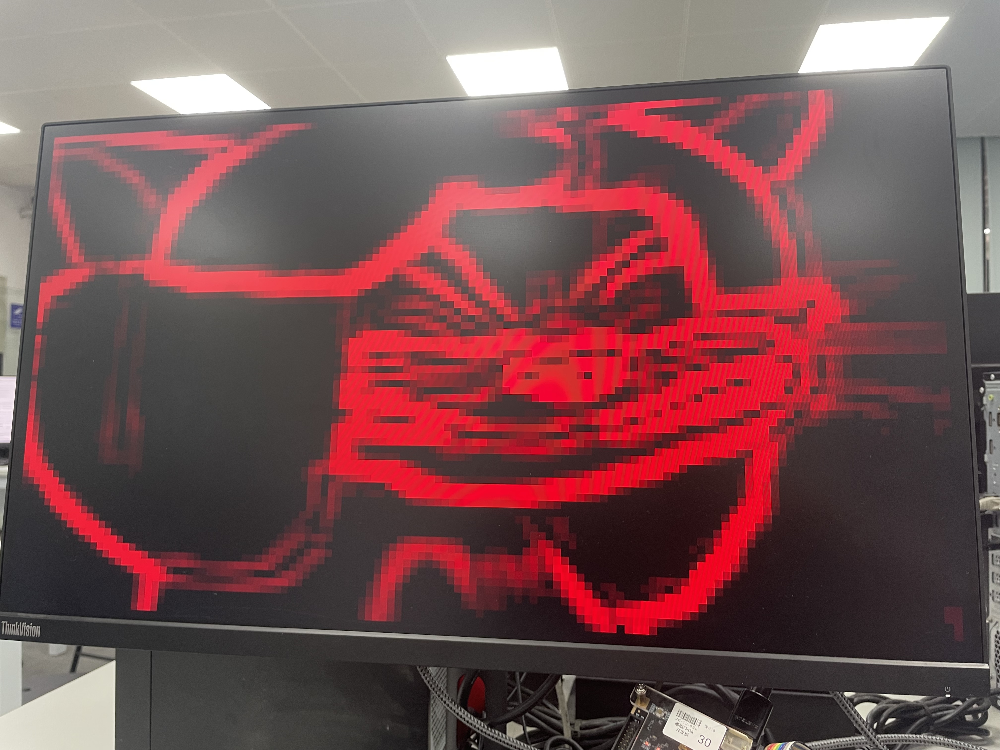

#  实验报告04

---

## 第一部分：基础实验

### 一、实验目的

1. 掌握 ZYNQ-7020 异构 SoC 中 **PS（ARM Cortex-A9）与 PL（FPGA）协同工作**的设计方法。
2. 掌握 **AXI BRAM** 作为 PS-PL 共享内存的配置与读写方式。
3. 掌握 **UART 串口图像传输协议**的设计与实现。
4. 掌握 **Sobel 边缘检测算法**的 FPGA 硬件实现（流水线卷积、梯度计算、幅值近似）。
5. 掌握 **HDMI 视频时序**的 FPGA 生成方法（1280×720p@60Hz）。
6. 完成一套完整的 **PC → UART → PS → BRAM → PL(Sobel) → HDMI** 图像处理链路。

---

### 二、系统总体架构

#### 2.1 整体数据流

```
┌──────────┐    UART      ┌──────────────────────────────────┐    HDMI     ┌──────────┐
│   PC端   │ ──────────▶  │        ZYNQ-7020 开发板           │ ─────────▶  │  显示器   │
│ 摄像头/  │  115200bps   │                                   │  1280×720   │          │
│ 图片文件 │              │  ┌─────────┐    ┌──────────────┐  │  @60Hz      │          │
└──────────┘              │  │ PS 端   │    │   PL 端       │  │             └──────────┘
                          │  │         │    │               │  │
                          │  │ UART接收 │AXI │ BRAM读取      │  │
                          │  │   ↓     │──▶│   ↓           │  │
                          │  │ 写BRAM  │    │ rgb_to_gray   │  │
                          │  │         │    │   ↓           │  │
                          │  │         │    │ sobel_core    │  │
                          │  │         │    │   ↓           │  │
                          │  │         │    │ edge_mem      │  │
                          │  │         │    │   ↓           │  │
                          │  │         │    │ HDMI时序+输出 │  │
                          │  └─────────┘    └──────────────┘  │
                          └──────────────────────────────────┘
```

#### 2.2 硬件模块层次

```
top.v
├── ps_uart_bram_hdmi_wrapper (Block Design)
│   ├── processing_system7_0     — ZYNQ PS7 (Cortex-A9 + UART + AXI GP)
│   ├── axi_smc_0                — AXI SmartConnect
│   ├── axi_bram_ctrl_0          — AXI BRAM Controller
│   └── blk_mem_gen_0            — Block Memory Generator (64KB 真双口BRAM)
│
└── hdmi_pl_top.v
    ├── video_clock              — MMCM 时钟管理 (sys_clk → 74.25MHz + 5×)
    ├── hdmi_bram_sobel_display  — BRAM读图 + 灰度 + Sobel + HDMI时序 + 彩色边缘输出
    │   ├── rgb_to_gray          — RGB888 → 灰度 (加权平均)
    │   └── sobel_core           — 3×3 Sobel 卷积核心
    └── rgb2dvi_0                — 并行RGB → TMDS差分信号
```

#### 2.3 关键参数

| 参数 | 值 | 说明 |
| --- | --- | --- |
| 输入图像分辨率 | 128 × 72 | 受限于 UART 带宽 |
| 输入像素格式 | RGB888 (24-bit) | 每像素 3 字节 |
| BRAM 大小 | 64 KB | 地址空间 0x40000000 |
| BRAM 数据宽度 | 32-bit | 每地址存 1 像素 (0x00RRGGBB) |
| HDMI 输出分辨率 | 1280 × 720 | 标准 720p |
| 像素时钟 | 74.25 MHz | video_clock MMCM 生成 |
| 图像放大倍数 | 10×10 | 128→1280, 72→720 |
| 串口波特率 | 115200 bps | 8N1 格式 |
| 帧率 | ~0.2 fps | 瓶颈在串口带宽 |

---

### 三、硬件设计 — Block Design

#### 3.1 PS-PL 互联结构

ZYNQ PS 端通过 **M_AXI_GP0** 主端口，经 AXI SmartConnect 互连模块，连接到 AXI BRAM Controller，最终控制 Block Memory Generator 的 **Port A**（PS 读写口）。

Block Memory Generator 配置为**真双口 RAM（True Dual-Port RAM）**：
- **Port A**：PS 端通过 AXI BRAM Controller 读写（写入原始 RGB 图像）
- **Port B**：PL 端通过原生 BRAM 接口读取（读出原始 RGB 图像做 Sobel）

```
PS7 (M_AXI_GP0)
    │
    ▼
AXI SmartConnect      — 总线互连，支持多主多从
    │
    ▼
AXI BRAM Controller   — AXI4 协议 ↔ BRAM 原生接口转换
    │
    ▼
Block Memory Generator — 真双口 BRAM (64KB)
    │                  Port A: PS 读写
    │                  Port B: PL 只读
    ▼
hdmi_bram_sobel_display (PL端)
```

#### 3.2 BRAM 地址映射

| 项目 | 值 |
| --- | --- |
| 基地址 | `0x40000000` |
| 地址范围 | 64 KB（0x0000 – 0xFFFF） |
| 像素地址计算公式 | `addr = 0x40000000 + ((y × 128 + x) << 2)` |
| 像素数据格式 | `0x00RRGGBB`（高 8 位补 0，低 24 位为 RGB888） |

---

### 四、PL 端硬件设计 — Verilog 模块详解

#### 4.1 顶层模块 `top.v`

**功能**：连接 ZYNQ PS Block Design 与 PL HDMI 顶层，实现 BRAM 接口的信号桥接。

**关键连接**：
```verilog
// PS Block Design 的 BRAM Port B 信号
ps_uart_bram_hdmi_wrapper ps_uart_bram_hdmi_wrapper_i (
    .BRAM_PORTB_addr(bram_addr),   // PL → BRAM 地址
    .BRAM_PORTB_clk(bram_clk),     // PL → BRAM 时钟
    .BRAM_PORTB_dout(bram_dout),   // BRAM → PL 数据
    .BRAM_PORTB_en(bram_en),       // PL → BRAM 使能
    .BRAM_PORTB_we(bram_we),       // PL → BRAM 写使能 (固定为0，只读)
    .BRAM_PORTB_din(bram_din),     // PL → BRAM 写数据 (固定为0)
    ...
);

// PL HDMI 顶层
hdmi_pl_top hdmi_pl_top_i (
    .bram_clk(bram_clk), ...
    .hdmi_oen(hdmi_oen),
    .TMDS_clk_n(TMDS_clk_n), ...
);
```

#### 4.2 `hdmi_pl_top.v` — PL 顶层

**功能**：
1. 通过 `video_clock` MMCM 将外部 `sys_clk` 转换为 74.25MHz 像素时钟（`video_clk`）和 5× 串行时钟（`video_clk_5x`，371.25 MHz）
2. 生成 `video_rst` 复位信号（`video_locked` 后延迟 4 个周期释放）
3. 例化 `hdmi_bram_sobel_display` 完成全部图像处理
4. 例化 `rgb2dvi_0` 将并行 RGB + HS/VS/DE 转换为 TMDS 差分信号驱动 HDMI

**BRAM 时钟共享**：
```verilog
assign bram_clk = video_clk;   // BRAM Port B 使用像素时钟
```

#### 4.3 `hdmi_bram_sobel_display.v` — 核心显示模块（基础功能）

这是本实验最关键的 PL 端模块，集成了 BRAM 读取、灰度转换、Sobel 卷积、边缘存储和 HDMI 时序生成全部功能。

##### 4.3.1 模块接口

| 信号 | 方向 | 位宽 | 说明 |
| --- | --- | --- | --- |
| `clk` | input | 1 | 74.25MHz 像素时钟 |
| `rst` | input | 1 | 高有效复位 |
| `hs` / `vs` / `de` | output | 1 | HDMI 行同步 / 场同步 / 数据有效 |
| `rgb_r` / `rgb_g` / `rgb_b` | output | 8 | RGB 像素输出 |
| `bram_en` / `bram_we` | output | 1 / 4 | BRAM Port B 使能 / 写使能 |
| `bram_addr` / `bram_din` | output | 32 | BRAM 地址 / 写数据 |
| `bram_dout` | input | 32 | BRAM 读数据 |

##### 4.3.2 工作流程 — 三状态扫描状态机

模块内部使用一个 3 状态的状态机来协调 BRAM 扫描和 Sobel 运算：

```
         video_frame_start
  SCAN_IDLE ──────────────────▶ SCAN_RUN
      ▲                            │
      │         scan_last          │
      │   (x=127, y=71)            │
      │                            ▼
      │                       SCAN_WAIT
      │                            │
      │     edge_frame_done        │
      └────────────────────────────┘
```

- **SCAN_IDLE**：空闲状态，等待每个 HDMI 帧的起始（`h_cnt=0, v_cnt=0`）
- **SCAN_RUN**：逐像素扫描 BRAM，发出读地址，经过 2 级流水线对齐后将 RGB 数据送入 `rgb_to_gray` 和 `sobel_core`
- **SCAN_WAIT**：等待 `sobel_core` 输出 `edge_frame_done`，然后置位 `sobel_done` 通知 HDMI 输出端可以开始显示边缘结果

**关键代码**：
```verilog
// BRAM 扫描 — 流水线对齐
bram_en <= scan_issue || scan_valid_d1 || scan_valid_d2;
bram_addr_reg <= scan_issue ? {16'd0, scan_word_addr, 2'b00} : 32'd0;

scan_valid_d1 <= scan_issue;       // 第1级延迟：读命令发出
scan_valid_d2 <= scan_valid_d1;    // 第2级延迟：BRAM数据返回
scan_x_d2 <= scan_x_d1;            // 坐标也同步延迟2级
scan_y_d2 <= scan_y_d1;
// scan_valid_d2 有效时，bram_dout 才是正确的 RGB 数据
```

##### 4.3.3 HDMI 时序生成

模块内置完整的 1280×720p@60Hz 标准 VESA 时序：

```verilog
parameter H_ACTIVE = 16'd1280;   // 水平有效像素
parameter H_FP     = 16'd110;    // 水平前沿
parameter H_SYNC   = 16'd40;     // 水平同步脉冲
parameter H_BP     = 16'd220;    // 水平后沿
parameter V_ACTIVE = 16'd720;    // 垂直有效行
parameter V_FP     = 16'd5;      // 垂直前沿
parameter V_SYNC   = 16'd5;      // 垂直同步脉冲
parameter V_BP     = 16'd20;     // 垂直后沿
```

时序参数对应的计算公式：
```
H_TOTAL = 1280 + 110 + 40 + 220 = 1650 像素
V_TOTAL = 720 + 5 + 5 + 20 = 750 行
帧率 = 74.25MHz / (1650 × 750) ≈ 60 Hz
```

##### 4.3.4 图像放大与坐标映射

128×72 的原始图像被放大到 1280×720 显示：

```verilog
localparam SCALE_X = H_ACTIVE / IMG_WIDTH;   // = 10
localparam SCALE_Y = V_ACTIVE / IMG_HEIGHT;  // = 10

assign disp_x = active_x / SCALE_X;   // 1280列 → 128列索引
assign disp_y = active_y / SCALE_Y;   // 720行  → 72行索引
assign disp_addr = {disp_y, 7'b0} + {7'd0, disp_x};  // y×128 + x
```

每个原始像素在 HDMI 上占据 10×10 的像素块，便于肉眼观察边缘检测的细节。

##### 4.3.5 边缘数据存储

```verilog
(* ram_style = "block" *) reg [7:0] edge_mem [0:9215];  // 128×72 = 9216 深度

// Sobel 结果写入 edge_mem
always @(posedge clk) begin
    if (edge_valid)
        edge_mem[edge_wr_addr] <= edge_data;
end

// HDMI 显示时从 edge_mem 读取
always @(posedge clk) begin
    ...
    edge_pixel <= edge_mem[edge_rd_addr];
end
```

`(* ram_style = "block" *)` 属性指示 Vivado 综合工具将此数组映射为 **Block RAM**（而非分布式 RAM），节省 LUT 资源。

#### 4.4 `rgb_to_gray.v` — RGB 转灰度模块

**功能**：将 RGB888 彩色像素转换为 8-bit 灰度值，采用 **ITU-R BT.601** 标准亮度加权公式。

**核心代码**：
```verilog
// Gray = R×0.299 + G×0.587 + B×0.114
// FPGA 定点实现：乘加后取高 8 位
wire [15:0] gray_calc;
assign gray_calc = ({8'd0, r} * 16'd77)    // R × 77 ≈ R × 0.299 × 256
                 + ({8'd0, g} * 16'd150)   // G × 150 ≈ G × 0.587 × 256
                 + ({8'd0, b} * 16'd29);   // B × 29 ≈ B × 0.114 × 256

// 取 gray_calc[15:8]，等效于除以 256
always @(posedge clk) begin
    gray <= gray_calc[15:8];
end
```

**权重验证**：77 + 150 + 29 = 256，归一化后 R:G:B ≈ 0.301:0.586:0.113，与人眼对不同颜色的敏感度一致。

**流水线特性**：该模块为纯组合逻辑计算 + 一级寄存器输出，总延迟为 1 个时钟周期。

#### 4.5 `sobel_core.v` — Sobel 卷积核心

##### 4.5.1 算法原理

Sobel 算子使用两个 3×3 卷积核分别检测水平梯度 Gx 和垂直梯度 Gy：

```
Gx = [-1  0  +1]        Gy = [-1 -2 -1]
     [-2  0  +2]             [ 0  0  0]
     [-1  0  +1]             [+1 +2 +1]
```

梯度幅值近似（省去平方和开方，节省硬件资源）：
```
|G| ≈ |Gx| + |Gy|
```

##### 4.5.2 3×3 滑动窗口实现

模块使用 **2 行行缓冲（line buffer）** + **9 个寄存器** 构建 3×3 滑动窗口：

```verilog
reg [7:0] line0 [0:WIDTH-1];   // 上一行像素缓冲
reg [7:0] line1 [0:WIDTH-1];   // 当前行像素缓冲

reg [7:0] top0, top1, top2;    // 3×3 窗口的第1行
reg [7:0] mid0, mid1, mid2;    // 3×3 窗口的第2行
reg [7:0] bot0, bot1, bot2;    // 3×3 窗口的第3行
```

数据流动方式：
```
新像素 gray 到达 → 存入 line1[gray_x]
                 → 同时读 line0[gray_x] (上一行同列) → prev2_pixel
                 → 同时读 line1[gray_x] (本行同列) → prev1_pixel

窗口移位：
top0←top1←top2←prev2_pixel
mid0←mid1←mid2←prev1_pixel
bot0←bot1←bot2←gray
```

##### 4.5.3 卷积计算

```verilog
// 水平梯度 Gx（检测垂直边缘）
gx = -top0 + top2
     -(mid0 << 1) + (mid2 << 1)
     -bot0 + bot2;

// 垂直梯度 Gy（检测水平边缘）
gy = -top0 - (top1 << 1) - top2
     +bot0 + (bot1 << 1) + bot2;

// 绝对值（有符号数取绝对值）
abs_gx = gx[11] ? (~gx + 1) : gx;   // 补码取反加1
abs_gy = gy[11] ? (~gy + 1) : gy;

// 幅值近似
mag = abs_gx + abs_gy;

// 饱和截断到 8-bit
edge_data = (mag > 255) ? 8'hff : mag[7:0];
```

**位宽分析**：
- 输入 `gray` 为 8-bit（0–255）
- Gx/Gy 涉及 6 个像素的加减和乘 2 运算，最大绝对值 ≈ 6 × 255 = 1530
- 使用 12-bit 有符号数存储 Gx/Gy（范围 -2048 ~ +2047）
- mag = |Gx| + |Gy| 最大约 3060，使用 13-bit 足够

##### 4.5.4 边界处理

边界像素（第一行、最后一行、第一列、最后一列）没有完整的 3×3 邻域，强制输出 edge_data = 0：

```verilog
if ((gray_x >= 1) && (gray_y >= 1) &&
    ((out_x == 0) || (out_y == 0) ||
     (out_x == WIDTH-1) || (out_y == HEIGHT-1))) begin
    edge_data <= 8'd0;    // 边界像素 → 边缘强度为0
end
```

##### 4.5.5 尾部冲刷（Flush）机制

当最后一行的最后一个像素处理完毕后，`sobel_core` 进入 **flush** 状态，逐像素输出 `edge_data = 0` 以填充 `edge_mem` 中尚未被写入的底部两行边界区域（这两行在 3×3 窗口滑动过程中被跳过了）。flush 结束后拉高 `edge_frame_done`。

---

### 五、PS 端软件设计

#### 5.1 程序功能

PS 端运行裸机 C 程序 `main.c`，完成以下功能：

1. **UART 初始化**：配置 PS UART 为 115200 bps、8N1 格式
2. **测试图写入**：启动后向 BRAM 写入一张 128×72 彩色渐变测试图，方便上电后即可验证 HDMI 输出
3. **帧接收循环**：按约定协议接收 PC 端发送的图像帧，校验帧头/行头，写入 BRAM

#### 5.2 串口帧协议

```
帧格式:
┌──────┬──────┬─────────┬───────────┬─────────┬──────┬────────────────────────┐
│ 0x55 │ 0xAA │ width_l │ width_h   │height_l │height_h│ 0x18  │  行数据 × height 行   │
│ 帧头  │      │  (16bit小端)        │ (16bit小端)       │ RGB888│                        │
└──────┴──────┴─────────┴───────────┴─────────┴──────┴────────────────────────┘

行格式:
┌──────┬──────┬───────┬───────┬──────────────────────┐
│ 0x33 │ 0xCC │ row_l │ row_h │  R G B × width 像素  │
│ 行头  │      │ (16bit小端)    │                      │
└──────┴──────┴───────┴───────┴──────────────────────┘
```

#### 5.3 关键代码逻辑

```c
// 帧接收状态机
static int receive_frame(void) {
    // 1. 等待并验证帧头 0x55 0xAA
    wait_for_sync(0x55, 0xAA, UART_WAIT_MS);

    // 2. 接收并校验 width(128), height(72), format(0x18=RGB888)
    uart_recv_u16_le(&width, UART_WAIT_MS);
    uart_recv_u16_le(&height, UART_WAIT_MS);
    uart_recv_byte_timeout(&format, UART_WAIT_MS);
    if (width != 128 || height != 72 || format != 0x18) return -1;

    // 3. 逐行接收：行头 0x33 0xCC → 行号 → 128个RGB像素
    for (row = 0; row < 72; row++) {
        wait_for_sync(0x33, 0xCC, UART_WAIT_MS);   // 等待行头
        uart_recv_u16_le(&row_num, UART_WAIT_MS);   // 校验行号
        for (x = 0; x < 128; x++) {
            // 接收 R, G, B 各 1 字节 → 写入 BRAM
            framebuffer_write_pixel(x, row, r, g, b);
        }
    }
    return 0;
}
```

---

### 六、实验步骤

#### 6.1 Vivado 硬件工程

1. 打开 Vivado 工程 `sobel_04_uart_sobel_hdmi.xpr`
2. 确认 Sources 中包含以下文件：
   - `top.v`、`hdmi_pl_top.v`
   - `hdmi_bram_sobel_display.v`
   - `rgb_to_gray.v`、`sobel_core.v`
   - Block Design `ps_uart_bram_hdmi`
3. 确认约束文件 `hdmi_out_test.xdc` 已启用
4. 依次执行：**Run Synthesis → Run Implementation → Generate Bitstream**
5. 导出硬件并启动 SDK

> 

> 

#### 6.2 SDK 软件工程

1. 打开 SDK 工作区
2. 右键 `ps_uart_bram_app_bsp` → **Re-generate BSP Sources**
3. 右键 `ps_uart_bram_app` → **Build Project**
4. 连接开发板，下载 bitstream：**Xilinx → Program FPGA**
5. 运行 PS 程序：右键 `ps_uart_bram_app` → **Run As → Launch on Hardware**

#### 6.3 PC 端发送图像

```bash
conda activate fpga
cd host_camera_uart

# 发送摄像头视频
python camera_uart_sender.py --port COM7 --baud 115200 --camera 0 --fps 0.2 --preview

# 发送单张图片
python camera_uart_sender.py --port COM7 --baud 115200 --image test.jpg --once --preview
```

**注意**：运行 Python 脚本前必须关闭串口调试助手。

---

### 七、基础实验结果

#### 7.1 串口输出

PS 程序运行后，串口调试助手应显示：

```
PS UART PL Sobel HDMI display
BRAM base: 0x40000000, baud: 115200, image: 128x72
waiting for frame header
```

发送图像后显示 `received frame 1`、`received frame 2`……

> 

#### 7.2 HDMI 显示 — 基础实验效果

- **上电后**（未发送图像）：显示测试图的 Sobel 黑白边缘检测结果
- **发送图像后**：显示对应输入图像的 Sobel 黑白边缘图（黑底白边，边缘强度以灰度渐变呈现）

> 

#### 7.3 基础版的 RGB 输出逻辑

```verilog
// 基础版：边缘以灰度方式显示（R=G=B=edge_pixel）
assign rgb_r = (de_reg_d0 && sobel_done) ? edge_pixel : 8'h00;
assign rgb_g = (de_reg_d0 && sobel_done) ? edge_pixel : 8'h00;
assign rgb_b = (de_reg_d0 && sobel_done) ? edge_pixel : 8'h00;
```

---

## 第二部分：拓展实验 — 彩色边缘标记

### 八、拓展目标

在基础实验的黑白灰度边缘显示基础上，将边缘检测结果改为**彩色显示**：
- 非边缘区域 → **黑色背景**
- 边缘区域 → 以**红色、绿色或蓝色**突出显示
- 边缘亮度与 Sobel 梯度强度成正比
- 通过可调阈值参数过滤低强度噪点

### 九、实现原理

#### 9.1 核心改动位置

修改**仅限** `hdmi_bram_sobel_display.v` 的 RGB 输出映射层（第 136–152 行），不涉及以下模块的任何修改：

| 模块 | 修改 | 原因 |
| --- | --- | --- |
| `sobel_core.v` | 无 | Sobel 卷积计算本身不需要改变 |
| `rgb_to_gray.v` | 无 | 灰度转换逻辑不变 |
| BRAM 扫描状态机 | 无 | 图像读取流程不变 |
| HDMI 时序生成 | 无 | 时序参数不变 |
| `hdmi_pl_top.v` | 无（仅可选传参）| 例化接口兼容 |
| `top.v` | 无 | 顶层连线不变 |

#### 9.2 新增参数

```verilog
parameter [1:0] COLOR_SEL     = 2'd0;   // 颜色选择：0=红色, 1=绿色, 2=蓝色
parameter [7:0] EDGE_THRESHOLD = 8'd48;  // 边缘阈值：低于此值视为背景
```

| 参数 | 位宽 | 默认值 | 取值范围 | 作用 |
| --- | --- | --- | --- | --- |
| `COLOR_SEL` | 2-bit | `2'd0` | 0/1/2 | 选择边缘高亮颜色（红/绿/蓝） |
| `EDGE_THRESHOLD` | 8-bit | `8'd48` | 0–255 | 区分"有效边缘"与"背景噪点"的分界值 |

#### 9.3 彩色映射逻辑（核心代码）

```verilog
// === 第1步：阈值判断 ===
// 只有边缘强度 ≥ 阈值的像素才被认为是"有效边缘"
wire edge_is_strong;
assign edge_is_strong = (edge_pixel >= EDGE_THRESHOLD);

// === 第2步：颜色通道选择 ===
// 根据 COLOR_SEL 将边缘强度映射到单一颜色通道
wire [7:0] color_r;
wire [7:0] color_g;
wire [7:0] color_b;

assign color_r = (COLOR_SEL == 2'd0) ? edge_pixel : 8'd0;
assign color_g = (COLOR_SEL == 2'd1) ? edge_pixel : 8'd0;
assign color_b = (COLOR_SEL == 2'd2) ? edge_pixel : 8'd0;

// === 第3步：最终 RGB 输出 ===
// 有效显示区 + Sobel完成 + 强边缘 → 彩色
// 否则 → 黑色 (0, 0, 0)
assign rgb_r = (de_reg_d0 && sobel_done && edge_is_strong) ? color_r : 8'd0;
assign rgb_g = (de_reg_d0 && sobel_done && edge_is_strong) ? color_g : 8'd0;
assign rgb_b = (de_reg_d0 && sobel_done && edge_is_strong) ? color_b : 8'd0;
```

#### 9.4 决策逻辑图解

```
每个像素的输出决策：
│
├── de_reg_d0 == 0 ?                → (0,0,0) 消隐区输出黑色
├── sobel_done == 0 ?               → (0,0,0) Sobel未完成，输出黑色
├── edge_pixel < EDGE_THRESHOLD ?   → (0,0,0) 弱边缘→抑制为黑色背景
└── edge_pixel ≥ EDGE_THRESHOLD ?   → 根据 COLOR_SEL 输出彩色：
    ├── COLOR_SEL = 0:  (edge_pixel, 0, 0)        红色，亮度=边缘强度
    ├── COLOR_SEL = 1:  (0, edge_pixel, 0)        绿色，亮度=边缘强度
    └── COLOR_SEL = 2:  (0, 0, edge_pixel)        蓝色，亮度=边缘强度
```

#### 9.5 设计原理分析

**为什么边缘亮度与梯度强度成正比？**

边缘强度 `edge_pixel` 直接作为所选颜色通道的 8-bit 亮度值（0–255），这意味着：
- 强对比度边缘（如物体轮廓）→ 高亮彩色（如亮红色 #FF0000 附近）
- 弱对比度边缘（如纹理细节）→ 暗淡彩色（如暗红色 #300000 附近）
- 非边缘区域（平坦区域 + 阈值过滤）→ 纯黑色

这种**亮度调制**方式保留了梯度强度的连续信息，比固定强度二值化（0 或 255）包含更丰富的边缘层次。

**为什么需要阈值？**

Sobel 算子在图像平坦区域也会产生非零的小幅梯度（由于量化噪声或极其微弱的纹理）。如果不加阈值过滤，这些伪边缘也会以暗彩色显示，影响观感。`EDGE_THRESHOLD = 48` 是一个经验默认值，在保留真实边缘和抑制噪点之间取得平衡。

### 十、使用方法与参数配置

#### 10.1 修改颜色

在 `hdmi_pl_top.v` 中例化时，通过 `#()` 传递参数重载默认值：

```verilog
// 红色边缘（默认）
hdmi_bram_sobel_display #(
    .COLOR_SEL(2'd0),
    .EDGE_THRESHOLD(8'd48)
) hdmi_bram_sobel_display_m0 (...);

// 绿色边缘
hdmi_bram_sobel_display #(
    .COLOR_SEL(2'd1),
    .EDGE_THRESHOLD(8'd48)
) hdmi_bram_sobel_display_m0 (...);

// 蓝色边缘
hdmi_bram_sobel_display #(
    .COLOR_SEL(2'd2),
    .EDGE_THRESHOLD(8'd48)
) hdmi_bram_sobel_display_m0 (...);
```

修改后重新综合、实现、生成 bitstream 即可。

#### 10.2 阈值调节建议

| 阈值 | 适用场景 | 效果 |
| --- | --- | --- |
| 0 | 调试用 | 显示所有梯度（包括噪点），等同于无阈值模式 |
| 16–32 | 弱边缘场景 | 保留较多细节，背景有少量暗色噪点 |
| **48（默认）** | **通用** | **平衡噪点抑制与边缘保留** |
| 64–80 | 强边缘场景 | 仅显示清晰轮廓，画面干净但丢失纹理细节 |
| 128+ | 极简场景 | 仅显示最强对比度边缘 |

### 十一、拓展实验结果

#### 11.1 红色输出

> 
>
> 

| 配置 | HDMI 显示效果 |
| --- | --- |
| COLOR_SEL=0（红色） | 黑色背景 + **红色**边缘 |
| COLOR_SEL=1（绿色） | 黑色背景 + **绿色**边缘 |
| COLOR_SEL=2（蓝色） | 黑色背景 + **蓝色**边缘 |

## 第三部分：总结与思考

### 十二、实验总结

本实验完成了以下工作：

1. **基础实验**：搭建了完整的 ZYNQ-7020 UART 图像传输 + PL Sobel 边缘检测 + HDMI 显示系统，掌握了 PS-PL 协同设计、AXI BRAM 共享内存、Verilog 图像处理流水线和 HDMI 时序生成等关键技术。

2. **拓展实验**：在基础系统上实现了**彩色边缘标记**功能。通过修改 `hdmi_bram_sobel_display.v` 中约 20 行 RGB 输出映射的组合逻辑，将黑白灰度边缘转换为可配置颜色的彩色边缘，并引入阈值参数实现自适应噪点过滤。

### 十三、拓展设计的优点

| 优点 | 说明 |
| --- | --- |
| **最小侵入性** | 仅修改 RGB 输出映射层，不触碰 Sobel 运算核心 |
| **零资源增长** | 纯组合逻辑修改，无额外寄存器、BRAM、DSP |
| **高度可配置** | 颜色（3 种）和阈值（256 级）均可参数化 |
| **向后兼容** | 保持与原系统的接口完全一致 |
| **实用性强** | 彩色边缘比黑白边缘更醒目，适合教学演示 |

### 十四、遇到的问题与解决方法

| 问题 | 原因 | 解决方法 |
| --- | --- | --- |
| HDMI 黑屏 | `sobel_done` 未置位，第一帧无输出 | 正确实现 SCAN_WAIT → edge_frame_done 握手 |
| 边缘噪点过多 | 无阈值过滤，平坦区域微梯度也被显示 | 引入 `EDGE_THRESHOLD` 参数，默认值 48 |
| BRAM 读数据坐标不对齐 | BRAM 读延迟 2 周期，坐标未同步延迟 | 坐标信号也经过 2 级流水线延迟对齐 |
| 画面不稳定 | 串口数据丢失导致帧错误 | 降低 `--fps`、增加 `--line-delay` |

### 十五、文件清单

| 文件 | 路径 | 说明 |
| --- | --- | --- |
| `top.v` | `srcs/sources_1/new/` | 系统顶层 |
| `hdmi_pl_top.v` | `srcs/sources_1/new/` | PL 端顶层（时钟 + 显示 + DVI） |
| `hdmi_bram_sobel_display.v` | `srcs/sources_1/new/` | **核心模块**（BRAM 读取 + 灰度 + Sobel + HDMI + 彩色边缘） |
| `sobel_core.v` | `srcs/sources_1/new/` | 3×3 Sobel 卷积核心 |
| `rgb_to_gray.v` | `srcs/sources_1/new/` | RGB 转灰度（BT.601） |
| `hdmi_bram_display.v` | `srcs/sources_1/new/` | 原始 BRAM 直显示模块（参考对比） |
| `main.c` | `ps_uart_sobel_bram_app/src/` | PS 端 UART 接收与 BRAM 写入程序 |
| `hdmi_out_test.xdc` | 约束文件 | HDMI 管脚约束 |
| `彩色边缘标记_拓展说明.md` | 项目根目录 | 拓展设计说明 |
| `README.md` | 项目根目录 | 实验总说明 |
